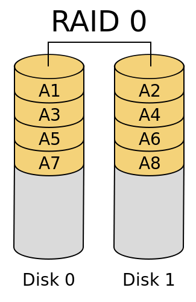
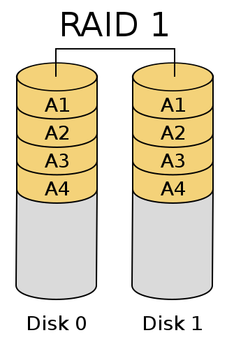
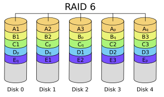
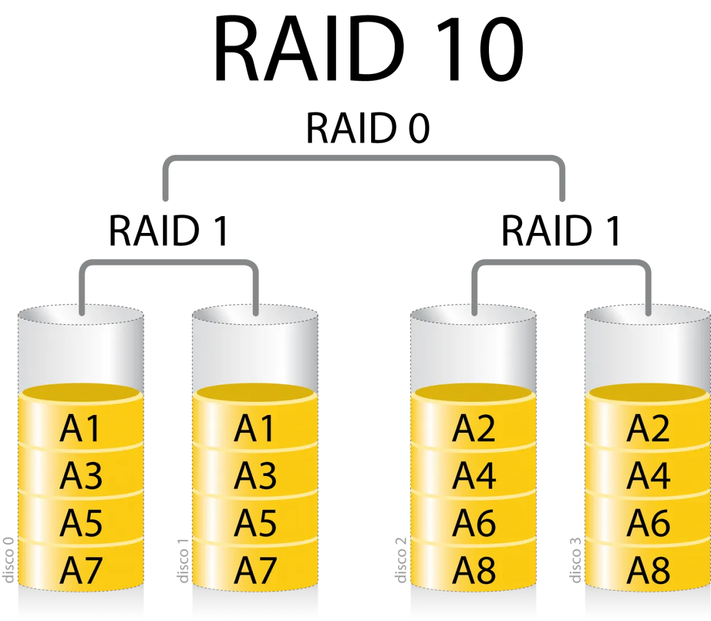

# Tema 1 - ASPECTOS BÁSICOS DE ADMINISTRACIÓN

1. Tareas del administrador
2. Hardware del servidor
   1. CPD
   2. Sistemas rack
   3. Sistemas RAID
   4. Servidores
3. Software del servidor

## 1. Tareas del administrador

Un sistema informático necesita una configuración inicial y una atención continua para funcionar correctamente.

Tareas que debe gestionar el administrador:

- **Instalación y configuración del software**
- **Configurar dispositivos**
- **Administración de usuarios**
- **Iniciar y apagar el sistema**
- **Registrar los cambios en el sistema**
- **Realizar copias de seguridad periodicas** 
- **Formar usuarios**
- **Aconsejar a los usuarios**
- **Asegurar el sistema**

## 2. Hardware del servidor 

### 2.1. CPD

El cpd o centro de proceso de datos es el lugar mas importante y seguro de una empresa, ya que en el se encuentran los servidores de la empresa.

Un CPD puede tener las siguientes **caracteristicas:**
- **Control de acceso**
- **Racks**
- **Sistemas de alimentacion redudantes (SAI/UPS)**
- **Ventilacion**
- **Cableado**
- **Sitema antiincendios**

### 2.2. Sistemas de alimentacion

Existen diferentes formas de mantener un servidor activo: 
- **Disponer de un SAI**
- **Disponer de un generador electrico**
- **Disponer de varias lineas electricas**
- **Que el servidor disponga de dos fuentes de alimentacion redundantes**

### 2.3. Factores de forma

Existen varios factores de forma de un servidor como pueden ser: 
- **Torre:** el formato tradicional, no recomendado para grandes servidores
- **Blade:** para sistemas de alta prestacion, parecidos al formato rack 
- **Rack:** El formato mas utilizado

#### 2.3.1. Rack

Es una estanteria o armario donde los servidores se colocan uno encima de otro, esto permite que los servidores ocupen menor espacio, para una mejor ventilacion. El formato mas utilizado es el Rack 19" 

### 2.4. RAID 

El **RAID** es un grupo de discos que actuan como un unico esto permite conseguir o mejor velocidad o tolerancia a fallos, segun el tipo de RAID a usar (hay 6 niveles)

**RAID 0 - Striping**
Divide los datos en bloques y los escribe en varios discos simultaneamente, ofreciendo el mejor rendimiento y la mayor velocidad de escritura/lectura, pero si un disco falla, se pierden todos los datos 

**RAID 1 - Mirroring**
Crea una copia exacta de los datos de un disco en otro (espejo), ofrece una buena redundancia dado que si un disco falla el otro tiene una copia completa de los datos, su desventaja es que la capacidad total es de solo un disco, si tienes dos discos de 1Tb solo tendras 1Tb de capacidad 

**RAID 5 - Striping con paridad distribuida**
Combina el RAID 0 con un dato de paridad que se distribuye equitativamente entre todos los discos, ofrece buen equilibrio entre rendimiento, capacidad y redundancia, puede tolerar fallos en un solo disco sin perder datos, la desventaja es que la recuperacion de datos despues de un fallo puede ser lento (requiere minimo tres discos)

**RAID 6 - Striping con doble paridad**
Similar al RAID 5 pero con un segundo bloque de paridad lo que permite tolerancia a fallos en dos discos duros, ofrece mayor redundancia que el RAID 5 pero requiere de mas discos duros (minimo 4)

**RAID 10 (RAID 1 + 0)**
Combina el mirroring con el striping, los discos se clonan en espero primero y luego se agrupan como un RAID 0, ofrece un excelente rendimiento de lectura/escritura y alta redundancia, puede soportar fallos en varios discos duros 

