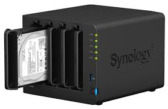

# Tema 1 - ASPECTOS BÁSICOS DE ADMINISTRACIÓN

## 1. Tareas del administrador

Un sistema informático necesita una configuración inicial y una atención continua para funcionar correctamente.

Tareas que debe gestionar el administrador:

- **Instalación y configuración del software**
- **Configurar dispositivos**
- **Administración de usuarios**
- **Iniciar y apagar el sistema**
- **Registrar los cambios en el sistema**
- **Realizar copias de seguridad periódicas** 
- **Formar usuarios**
- **Aconsejar a los usuarios**
- **Asegurar el sistema**

## 2. Hardware del servidor 

### 2.1. CPD

El CPD o centro de proceso de datos es el lugar más importante y seguro de una empresa, ya que en él se encuentran los servidores de la empresa.

Un CPD puede tener las siguientes **características:**
- **Control de acceso**
- **Racks**
- **Sistemas de alimentación redundantes (SAI/UPS)**
- **Ventilación**
- **Cableado**
- **Sistema antiincendios**

### 2.2. Sistemas de alimentación

Existen diferentes formas de mantener un servidor activo: 
- **Disponer de un SAI**
- **Disponer de un generador eléctrico**
- **Disponer de varias líneas eléctricas**
- **Que el servidor disponga de dos fuentes de alimentación redundantes**

### 2.3. Factores de forma

Existen varios factores de forma de un servidor como pueden ser: 
- **Torre:** el formato tradicional, no recomendado para grandes servidores
- **Blade:** para sistemas de alta prestación, parecidos al formato rack 
- **Rack:** El formato más utilizado

#### 2.3.1. Rack

Es una estantería o armario donde los servidores se colocan uno encima de otro, esto permite que los servidores ocupen menor espacio, para una mejor ventilación. El formato más utilizado es el Rack 19" 

### 2.4. RAID 

El **RAID** es un grupo de discos que actúan como uno único, esto permite conseguir o mejor velocidad o tolerancia a fallos, según el tipo de RAID a usar (hay 6 niveles).

**RAID 0 - Striping**
Divide los datos en bloques y los escribe en varios discos simultáneamente, ofreciendo el mejor rendimiento y la mayor velocidad de escritura/lectura, pero si un disco falla, se pierden todos los datos. 

**RAID 1 - Mirroring**
Crea una copia exacta de los datos de un disco en otro (espejo), ofrece una buena redundancia dado que si un disco falla el otro tiene una copia completa de los datos. Su desventaja es que la capacidad total es de solo un disco, si tienes dos discos de 1Tb solo tendrás 1Tb de capacidad. 

**RAID 5 - Striping con paridad distribuida**
Combina el RAID 0 con un dato de paridad que se distribuye equitativamente entre todos los discos, ofrece buen equilibrio entre rendimiento, capacidad y redundancia. Puede tolerar fallos en un solo disco sin perder datos, la desventaja es que la recuperación de datos después de un fallo puede ser lenta (requiere mínimo tres discos).

**RAID 6 - Striping con doble paridad**
Similar al RAID 5 pero con un segundo bloque de paridad, lo que permite tolerancia a fallos en dos discos duros. Ofrece mayor redundancia que el RAID 5 pero requiere de más discos duros (mínimo 4).

**RAID 10 (RAID 1 + 0)**
Combina el mirroring con el striping, los discos se clonan en espejo primero y luego se agrupan como un RAID 0. Ofrece un excelente rendimiento de lectura/escritura y alta redundancia, puede soportar fallos en varios discos duros. 

#### 2.4.1 Tipos de RAID

- **RAID por Software**
   Se implementa en el kernel en la parte encargada de la gestión de discos. Es una solución menos costosa, funciona con todos los discos y no depende de un hardware específico. No ofrece el mejor rendimiento, ya que es la CPU del sistema la que realiza la gestión. Un ejemplo de este RAID es el driver del kernel de Linux (mdadm). 

- **RAID por Hardware**
   Se usa un controlador físico, generalmente una tarjeta PCI, que gestiona los discos de manera independiente al sistema operativo. Ofrece un rendimiento superior al tener su propio procesador y RAM, y suelen tener características más avanzadas que el RAID por software. 

### 2.5. NAS 
   
   Es un dispositivo físico que se instala en una red local y que ofrece una unidad de almacenamiento dedicada y centralizada a la que se accede a través de la red. Funciona como una nube privada y en el sistema operativo se monta como una unidad de red. Están diseñados específicamente para el almacenamiento de datos, por lo que incluyen software especializado y capacidades de RAID. 
   **Algunas de sus características son:**
   
- **Centralización de datos:** Permiten a varios usuarios acceder y almacenar datos de manera simultánea en una misma ubicación, eliminando el problema de tener datos en diferentes equipos. 
- **Acceso remoto:** Algunos NAS permiten usarse como una nube privada accesible desde cualquier lugar, otros requieren de una configuración más avanzada. 
- **Facilidad de uso:** Un NAS suele disponer de una interfaz WEB fácil de usar, lo que facilita su uso y configuración. 
- **Escalabilidad:** Muchos modelos permiten añadir más discos duros, lo que permite ampliar el almacenamiento. 
- **Soluciones DIY:** Existen opciones de código abierto para montar tu propio NAS haciendo uso de PCs comunes o una Raspberry Pi. Estos software pueden ser [TrueNAS](https://www.truenas.com/) o [OpenMediaVault](https://www.openmediavault.org/).

