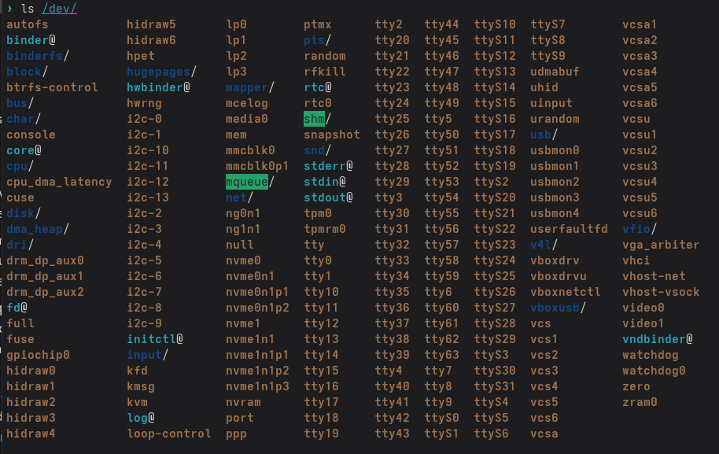
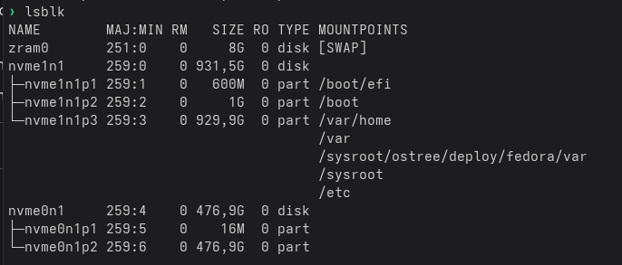
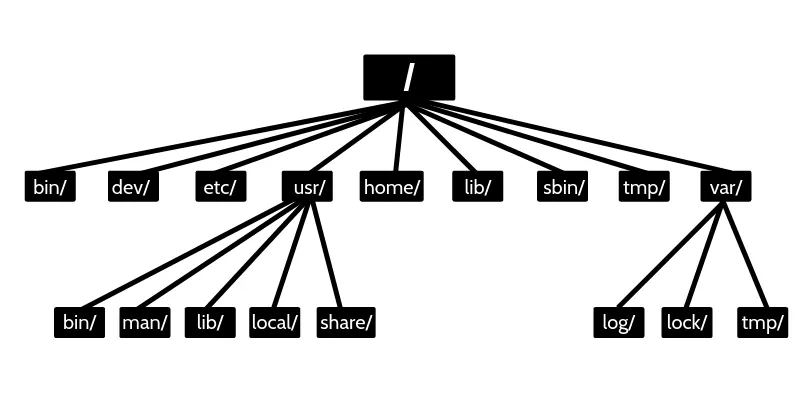

# Tema 2 - INSTALACION Y CONFIGURACION DE LINUX
## 1. Dispositivos
En los sistemas Linux todo se trata como un archivo, hasta los dispositivos estos se almacenan en el directorios 
**/dev** que significa devices, este contiene unos archivos especiales que representan los dispositivos de hardware conectados al sistema, hay diferentes tipos de dispositivos: 

- **Dispositivos de caracteres:** Manejan los datos como un flujo de caracteres sin buffer, util para dispositivos que envian datos caracter por carater como un teclado o una terminal 
- **Dispositivos de bloques:** Transfieren datos en bloques de tamaño fijo, se usan en dispositivos de almacenamiento
- **Dispositivos de red:** No tiene una representacin en un archivo ya que se gestionan a traves de una pila de red separada. Su configuracion e interfaces se pueden ver con comandos como ```ip a```




## 2. Particiones
El particionado es el proceso de dividir un disco duro en secciones logicas o particiones, cada una de ellas se ve por el sistema operativo como un disco independiente. Existen dos estandares principales para la gestion de particiones: 

- **MBR - Master Boot Record**
Es el metodo tradicional y mas antiguo. Utiliza una tabla de particiones que se encuentra en el primer sector del disco. Con MBR, solo se pueden crear hasta cuatro particiones primarias. Para superar esta limitación, se introdujeron las particiones extendidas, que actúan como contenedores para otras particiones, llamadas unidades lógicas. Solo puede haber una partición extendida por disco

- **GPT - GUID Partition Table**
Es un estándar más moderno y robusto que ha reemplazado a MBR. Ofrece una mayor flexibilidad, permitiendo hasta 128 particiones en la mayoría de los sistemas, y todas ellas son primarias. GPT también mejora la seguridad y la fiabilidad del particionado.

### 2.1. Nomenclatura de las particiones

Los dicos en linux se representan como un archivo en el directorio /dev, su nomenclatura es crucial para identificar cada dispositivos:

- **Discos SCSI/SATA/USB:** Se identifican con el prefijo ```dev/sd``` seguido de una letra, por ejemplo el primer disco seria ```/dev/sda``` y luego las particiones del disco como ```/dev/sda1 , /dev/sda2, etc``` 
- **Discos IDE:** Utilizan el prefijo ```/dev/hd```
- **Discos NVME:** Utilizan el prefijo ```nvmeXn1``` donde la X es el numero de disco, y sus particiones se definen como nvmeXn1pX donde la ultima X es el numero de particion, EJ: ```nvme0n1``` su primera particion seria ```nvme0n1p1```



### 2.2 Herramientas de particionado

Existen varias herramientas para crear particiones en linux tanto de linea de comandos como graficas 

- **fdisk y gdisk** Son herramientas de lineas de comandos para gestionar particiones
- **gparted** Es una herramienta con interfaz grafica de las mas populares

#### 2.2.1 Uso de fdisk 

- 1. Abrimos el disco: Esto se hace usando el comando ```sudo fdisk /dev/sdb```
- 2. Crear una particion (n)
    Dentro de fdisk, el comando n se utiliza para crear una nueva partición. Después de escribir n, la herramienta te hará varias preguntas:
        1. **Tipo de partición**: Te preguntará si quieres crear una partición primaria (p) o extendida (e). En el caso de GPT, solo verás la opción de partición primaria.
        2. **Número de partición**: Te pedirá un número para la nueva partición. Por ejemplo, 1, 2, 3, etc.
        3. **Primer y último sector**: Te preguntará por el sector de inicio y el sector final de la partición. Puedes especificar el tamaño en gigabytes (+10G), megabytes (+512M) o simplemente presionar Enter para usar los valores predeterminados, que suelen ser el primer sector disponible y el último sector del disco.
- 3. Borrar una particion (d): Para borrar una particion usamos el comando ```d```
- 4. Escibir los cambios (w): Es el paso mas importante, hasta que no escribamos los cambios no se aplicaran los cambios hechos 

## 3. Sistemas de ficheros 
Un sistema de archivos es la forma en la que los datos se organizan dentro de un disco o una particion. Es como el indice de una biblioteca, dice donde esta cada libro (archivo) y como esta ordenado. Esto incluye elementos como el superbloque , la tabla de nodos (inodes) y los bloques de datos reales 

En linux se pueden usar varios sistemas de archivos cada uno con sus ventajas e inconvenientes: 

- **ext2:** Fue el sistema de archivos estándar de Linux durante mucho tiempo. Es muy simple, pero carece de una función de seguridad crucial: el journaling.
- **ext3:** Es una evolución de ext2 que agrega journaling. El journaling es una característica que mantiene un registro de los cambios que se van a hacer en el sistema de archivos. Esto protege contra la corrupción de datos en caso de un fallo inesperado del sistema
- **ext4:** Es el sistema de archivos predeterminado en la mayoría de las distribuciones modernas de Linux. Es una mejora de ext3 que ofrece un mejor rendimiento, mayor capacidad de almacenamiento, y características adicionales como el soporte para extents, que ayuda a reducir la fragmentación.
- **Swap:** No es un sistema de archivos tradicional, sino un espacio de intercambio. Se utiliza como memoria virtual para que el sistema operativo pueda mover datos de la memoria RAM al disco duro cuando la RAM se llena, mejorando el rendimiento general.
- **Btrfs:** Un sistema más moderno que ofrece funciones avanzadas como las instantáneas (snapshots), que permiten crear copias de seguridad eficientes, y Copy-on-Write (CoW) para mayor integridad de los datos

#### 3.1. mkfs
El comando mkfs (make file system) se usa para formatear una particion usando el sistema de archivos decidido, su sintaxis es: 
``` sudo mkfs -t [sistema_de_ficheros] [particion]``` 

## 4. Directorios en Linux 

- **/ (Raiz):** Es el directorio principal del sistema, es el punto de partida de la estructura de archivos, todos los demas directorios y archivos cuelgan de el 
- **/boot:** Contiene los archivos esenciales para el arranque del sistema como el kernel de Linux y el gestor de arranque 
- **/etc:** Almacena los archivos de configuracion del sistema y de los programas instalados
- **/dev:** Contiene archivos que representan los dispositivos 
- **/home:** Aqui se almacenan los datos de los usuarios, cada usuario tiene su carpeta propua donde almacenar los documentos, descargas, videos, etc
- **/usr:** Aqui se almacenan la mayoria de aplicaciones y utilidades del sistema a las que pueden acceder los usuarios 
- **/var:** Contiene archivos que son variables y cambian constantemente mientras el sistema esta en funcionamiento, aqui tambien se guardan los archivos de registro **logs**
- **/tmp:** Contiene archivos temporales que se borran al reiniciar el sistema 
- **/media:** En los sistemas modernos, este directorio es el punto de montaje predeterminado para dispositivos extraíbles como unidades USB
- **/lost+found:** Cada sistema de archivos (partición) tiene su propio directorio lost+found. Es un lugar especial donde el programa de reparación de sistemas de archivos (fsck) coloca los fragmentos de archivos que se han perdido debido a una falla del sistema o un apagado inesperado. 




