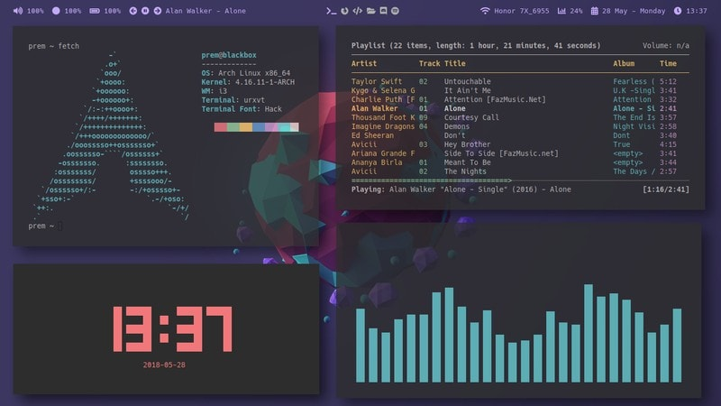
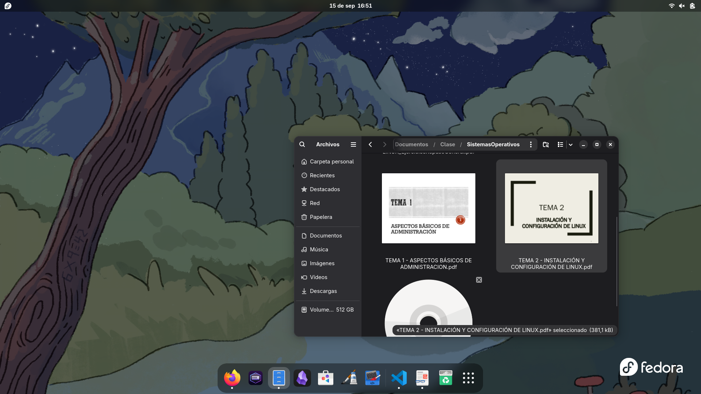
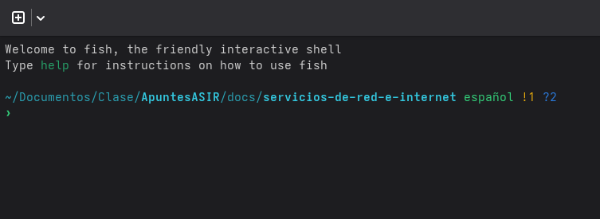

# Tema 2 - INSTALACION Y CONFIGURACION DE LINUX
## 1. Dispositivos
En los sistemas Linux todo se trata como un archivo, hasta los dispositivos estos se almacenan en el directorios 
**/dev** que significa devices, este contiene unos archivos especiales que representan los dispositivos de hardware conectados al sistema, hay diferentes tipos de dispositivos: 

- **Dispositivos de caracteres:** Manejan los datos como un flujo de caracteres sin buffer, util para dispositivos que envian datos caracter por carater como un teclado o una terminal 
- **Dispositivos de bloques:** Transfieren datos en bloques de tamaño fijo, se usan en dispositivos de almacenamiento
- **Dispositivos de red:** No tiene una representacin en un archivo ya que se gestionan a traves de una pila de red separada. Su configuracion e interfaces se pueden ver con comandos como ```ip a```


## 2. Particiones
El particionado es el proceso de dividir un disco duro en secciones logicas o particiones, cada una de ellas se ve por el sistema operativo como un disco independiente. Existen dos estandares principales para la gestion de particiones: 

- **MBR - Master Boot Record**
Es el metodo tradicional y mas antiguo. Utiliza una tabla de particiones que se encuentra en el primer sector del disco. Con MBR, solo se pueden crear hasta cuatro particiones primarias. Para superar esta limitación, se introdujeron las particiones extendidas, que actúan como contenedores para otras particiones, llamadas unidades lógicas. Solo puede haber una partición extendida por disco

- **GPT - GUID Partition Table**
Es un estándar más moderno y robusto que ha reemplazado a MBR. Ofrece una mayor flexibilidad, permitiendo hasta 128 particiones en la mayoría de los sistemas, y todas ellas son primarias. GPT también mejora la seguridad y la fiabilidad del particionado.

### 2.1. Nomenclatura de las particiones

Los dicos en linux se representan como un archivo en el directorio /dev, su nomenclatura es crucial para identificar cada dispositivos:

- **Discos SCSI/SATA/USB:** Se identifican con el prefijo ```dev/sd``` seguido de una letra, por ejemplo el primer disco seria ```/dev/sda``` y luego las particiones del disco como ```/dev/sda1 , /dev/sda2, etc``` 
- **Discos IDE:** Utilizan el prefijo ```/dev/hd```
- **Discos NVME:** Utilizan el prefijo ```nvmeXn1``` donde la X es el numero de disco, y sus particiones se definen como nvmeXn1pX donde la ultima X es el numero de particion, EJ: ```nvme0n1``` su primera particion seria ```nvme0n1p1```


### 2.2 Herramientas de particionado

Existen varias herramientas para crear particiones en linux tanto de linea de comandos como graficas 

- **fdisk y gdisk** Son herramientas de lineas de comandos para gestionar particiones
- **gparted** Es una herramienta con interfaz grafica de las mas populares

#### 2.2.1 Uso de fdisk 

- 1. Abrimos el disco: Esto se hace usando el comando ```sudo fdisk /dev/sdb```
- 2. Crear una particion (n)
    Dentro de fdisk, el comando n se utiliza para crear una nueva partición. Después de escribir n, la herramienta te hará varias preguntas:
        1. **Tipo de partición**: Te preguntará si quieres crear una partición primaria (p) o extendida (e). En el caso de GPT, solo verás la opción de partición primaria.
        2. **Número de partición**: Te pedirá un número para la nueva partición. Por ejemplo, 1, 2, 3, etc.
        3. **Primer y último sector**: Te preguntará por el sector de inicio y el sector final de la partición. Puedes especificar el tamaño en gigabytes (+10G), megabytes (+512M) o simplemente presionar Enter para usar los valores predeterminados, que suelen ser el primer sector disponible y el último sector del disco.
- 3. Borrar una particion (d): Para borrar una particion usamos el comando ```d```
- 4. Escibir los cambios (w): Es el paso mas importante, hasta que no escribamos los cambios no se aplicaran los cambios hechos 

## 3. Sistemas de ficheros 
Un sistema de archivos es la forma en la que los datos se organizan dentro de un disco o una particion. Es como el indice de una biblioteca, dice donde esta cada libro (archivo) y como esta ordenado. Esto incluye elementos como el superbloque , la tabla de nodos (inodes) y los bloques de datos reales 

En linux se pueden usar varios sistemas de archivos cada uno con sus ventajas e inconvenientes: 

- **ext2:** Fue el sistema de archivos estándar de Linux durante mucho tiempo. Es muy simple, pero carece de una función de seguridad crucial: el journaling.
- **ext3:** Es una evolución de ext2 que agrega journaling. El journaling es una característica que mantiene un registro de los cambios que se van a hacer en el sistema de archivos. Esto protege contra la corrupción de datos en caso de un fallo inesperado del sistema
- **ext4:** Es el sistema de archivos predeterminado en la mayoría de las distribuciones modernas de Linux. Es una mejora de ext3 que ofrece un mejor rendimiento, mayor capacidad de almacenamiento, y características adicionales como el soporte para extents, que ayuda a reducir la fragmentación.
- **Swap:** No es un sistema de archivos tradicional, sino un espacio de intercambio. Se utiliza como memoria virtual para que el sistema operativo pueda mover datos de la memoria RAM al disco duro cuando la RAM se llena, mejorando el rendimiento general.
- **Btrfs:** Un sistema más moderno que ofrece funciones avanzadas como las instantáneas (snapshots), que permiten crear copias de seguridad eficientes, y Copy-on-Write (CoW) para mayor integridad de los datos

#### 3.1. mkfs
El comando mkfs (make file system) se usa para formatear una particion usando el sistema de archivos decidido, su sintaxis es: 
``` sudo mkfs -t [sistema_de_ficheros] [particion]``` 

## 4. Directorios en Linux 

- **/ (Raiz):** Es el directorio principal del sistema, es el punto de partida de la estructura de archivos, todos los demas directorios y archivos cuelgan de el 
- **/boot:** Contiene los archivos esenciales para el arranque del sistema como el kernel de Linux y el gestor de arranque 
- **/etc:** Almacena los archivos de configuracion del sistema y de los programas instalados
- **/dev:** Contiene archivos que representan los dispositivos 
- **/home:** Aqui se almacenan los datos de los usuarios, cada usuario tiene su carpeta propua donde almacenar los documentos, descargas, videos, etc
- **/usr:** Aqui se almacenan la mayoria de aplicaciones y utilidades del sistema a las que pueden acceder los usuarios 
- **/var:** Contiene archivos que son variables y cambian constantemente mientras el sistema esta en funcionamiento, aqui tambien se guardan los archivos de registro **logs**
- **/tmp:** Contiene archivos temporales que se borran al reiniciar el sistema 
- **/media:** En los sistemas modernos, este directorio es el punto de montaje predeterminado para dispositivos extraíbles como unidades USB
- **/lost+found:** Cada sistema de archivos (partición) tiene su propio directorio lost+found. Es un lugar especial donde el programa de reparación de sistemas de archivos (fsck) coloca los fragmentos de archivos que se han perdido debido a una falla del sistema o un apagado inesperado. 


## 5. Entorno de escritorio
Un entorno de escritorio es un conjunto de programas que permiten interactuar con el sistema operativo de manera visual, ofreciendonos la opcion de gestionar un sistema Linux de una forma mas facil y amigable 

Dentro de los entornos de escritorio tenemos diferentes tipos segun su administrador de ventanas, por ejemplo tenemos administradores de ventanas flotantes usados en entornos de escritorio de ahora en adelante **DE** (para abreviar) como Gnome, KDE, Xfce, etc
Y luego tenenmos administradores de ventanas en mosaico (Tilling Window), como pueden ser I3, Sway, Awesome

La primera imagen muestra un **Tilling Window** la segunda muestra **Gnome**




## 6. Consolas 
Linux dispone de 6 consolas virtuales, que pueden ser usadas para varias tareas desde la resolucion de problemas, la seguridad y la administracion o realizar multitarea sin usar una interfaz grafica 

Para acceder a estas terminales, hacemos uso de la combinacion de teclas **Ctrl + Alt + FX** donde la **X** es el numero de la consola que se quiere usar, por ejemplo para acceder a la consola 2 (tty2) usariamos **F2**

Para volver al entorno grafico usamos **Alt + F7**

## 7. Shell 
Una shell es un interprete de comandos permite interactuar con el sistema operativo mediante una interfaz de texto, cuando se abre una terminal y se escribe un comando es la shell la que recibe la orden y le dice al sistema operativo que hacer, hay diferentes tipos de shell: 

- **Bourne shell (sh):** Es de las primeras que se empezo a usar ya no se usa casi aunque se puede encontrar en sistemas embebidos como routers que usan (imagenes de linux para ejecutar sus programas)
- **Bourne-Again Shell (bash):** Es la mas usada en la actualidad en sistemas linux y MacOs es la evolucion de sh pero añadiendo mejoras como autocompletado 
- **Z shell (zsh):** Esta basada en bash pero añadiendo muchas mejoras, como soporte para plugins, y personalizacion avanzada
- **Friendly interactive shell (fish):** Se creo con el objetivo de ser amigable y facil de usar nada mas instalarla, incluye autocompletacion, resaltado de sintaxis y sugerencias 
La siguiente imagen muestra fish con la personalizacion que tengo aplicada en mi sistema 



## 7. Dispositivos especiales 
En linux existen una serie de dispositivos que se usan para la comunicacion entre programas estos son los flujos de informacion, y encontramos tres: 

- **Entrada estandar (stdin):** Se representa con el numero **0** es el canal por el cual un programa recibe datos. Por lo general la entrada proviene del teclado del usuario pero tambien puede provenir de otro programa 
- **Salida estandart (stdout):** Se representa con el numero **1** es el canal por el cual un programa envia sus resultados normales. La salida estandart de un comando generalmente se muestra en pantalla 
- **Error estandart (stderr):** Se representa con el numero **2** es el canal por el cual un programa envia un mensaje de error o diagnostico. Por lo general tambien se muestran por pantalla estos mensajes 

Estos flujos son importantes para el uso de la linea de comandos sobretodo al trabajar con ShellScript, ya que permiten redirigir la entrada y la salida de los programas.

## 8. Tuberiasy redirecciones 
Permiten anidar comandos o pasar informacion de unos a otros.

- **La tuberia ( | ):** Permite conectar la salida de un comandos a le entrada de otro, creando una cadena sucesiva de comandos, por ejemplos al hacer un cat a un fichero de texto podemos usar una tuberia para pasar la salida a un grep y filtrar 

```cat mi_archivo.txt | grep manzana ``` 

- **Redirecciones:** Permiten dcontrolar la salida de un archivo
    - **>:** Redirecciona la salida estandart de un comando a un archivo
    - **>>:** Añade la salida a un archivo sin borrar su contenido 
    - **<:** Redirecciona la entrada de un comando para que la reciba un archivo 
    - **2>:** Redirecciona un error de un comando a un archivo
    - **2>>:** Añade el error a un archivo existente
    - **<&2:** Redirecciona la salida estandart para que se mezcle con un error estandart

## 9. Comodines 
Los comodines son caracteres especiales que usa la shell para emparejar patrones en nombres de archivos, tambien permiten seleccionar varios archivos a la vez

- **Asterisco (*):** Coincide con cero o mas caracteres. Por ejemplo ``` rm *.txt ``` borrara todos los archivos que terminen en **.txt**
- **Interrogacion (?):** Coincide con exactamente un solo caracter. Por ejemplos ``` ls archivo?.log ``` listara archivos como **archivo1.log** , **archivo2.log** 
- **Corchetes ([]):** Coincide con cualquiera de los caracteres listados dentro de los corchetes. Por ejemplo ``` mv foto[1-3].jpg fotos ``` movera los archivos **foto1.jpg** , **foto2.jpg** , **foto3.jpg**  a la carpeta fotos 

## 10. Comandos de manejo de ficheros 
Estos son los comandos mas comunes en cuanto al manejo de ficheros en Linux 

### 10.1 Navegacion y listado: 

- **pwd:** Imprime el directorio de trabajo actual 
- **cd:** Cambia el directorio 
- **ls:** Lista el contenido de un directorio 

### 10.2 Creacion y eliminacion: 

- **mkdir:** Crea nuevos directorios 
- **touch:** Crea un nuevo fichero vacio 
- **rm:** Elimina ficheros y directorios
- **ln:** Crea enlaces entre ficheros 

### 10.3 Copia y movimiento:

- **cp:** Copia ficheros y directorios 
- **mv:** Mueve ficheros y directorios 

### 10.4 Visualizacion y manipulacion:

- **cat:** Muestra el contenido de un fichero por pantalla 
- **more y less:** Muestra el contenido de un fichero por paginas 
- **head:** Muestra las primeras lineas de un fichero (10)
- **tail:** Muestra las ultimas lineas de un fichero (10)

### 10.5 Permisos y propiedad:

- **chmod:** Cambia los permisos de un fichero
- **chown:** Cambia el propietario de un fichero o directorio 
- **chgrp:** Cambia el grupo de un fichero o directorio 

### 10.6 Busqueda de ficheros y texto: 

- **find:** Busca ficheros y directorios en una jerarquia de archivos 
- **grep:** Busca patrones de texto dentro de ficheros 

### 10.7 Compresion y verificacion: 

- **zip y bzip2:** Comprimen y descomprimen ficheros 
- **md5sum:** Calcula y verifica la suma de verificacion MD5

### 10.8 Filtros:

- **sort:** Ordena las linas de un archivo de texto o la salida de otro comando, por defecto por orden alfabetico 
- **cut:** Recorta secciones de cada linea de archivos 
- **uniq:** Filtra lineas repetidas en un archivo
- **wc:** Cuenta el numero de lineas, palabras y caracteres de un archivo o salida de un comando 
- **tee:** Lee la entrada estándar y la escribe tanto en la salida estándar (pantalla) como en uno o más archivos. Es como una "T" en una tubería, dividiendo el flujo

## 11. Gestion de paquetes 
La forma mas facil y comun de instalar software en Linux a diferencia de Windows es por medio de un gestor de paquetes, segun la familia de la distribucion que usemos encontramos varios gestores de paquetes.

- **Distribuciones derivadas de debian (.deb):** Usan el gestor de paquetes apt (aptitude) y como gestor de bajo nivel se usa dpkg 
- **Distribcuiones derivadas de RedHat (.rpm):** Usan el gestor de paquetes dnf actualmente en su version 5 (yum ya esta en deshuso y usarlo solo lleva a un enlace simbolico a dnf), el gestor de bajo nivel es rpm 
- **Distribuciones derivadas de ArchLinux (tar.gz):** Usan el gestor de paquetes pacman y pacma para el repositorio de la comunidad (AUR), como tal no tiene paquetes si no que coge el codigo fuente y lo compila en ese momento 

### 11.1 Gestores de paquetes universales 
Los anteriores eran gestores de paquetes especificos de cada distribucion, pero luego encontramos unos gestores de paquetes que funcionan en todas las distribuciones independientemente la familia de la que vengan (normalmente estos paquetes se ejecutan en modo sandbox).

- **Snap:** Desarollado por canonical, permite empaquetar los programas y que sean usados en cualquier distribucion, su uso es ``` snap install [paquete] ```
- **Flatpak:** Al igual que snap pero mas extendido y con un catalogo de programas mayor, esta financiado por redhat, su uso es ``` flatpak install [paquete] ``` 
- **Appimage:** Este mas que un gestor de paquetes es una extension universal que se ejecuta en todas las distribuciones linux, permite crear apps portables 

## 12. WGET 

wget es una herramienta que permite descargar archivos de internet por medio de la terminal y en segundo plano, se usa ampliamente para descargar scripts o instaladores, tambien permite descargas recursivas 

## 13. Gestion de paquetes 

### 13.1 Instalacion de paquetes:

**Instalacion de paquetes:**
- Familia debian: ```sudo apt install [paquete]``` 
- Familia RHEL: ``` sudo dnf install [paquete]``` 
- Familia ArchLinux: ```sudo pacman -S [paquete]```

**Actualizar base de datos de paquetes:**
- Familia debian: ```sudo apt update ``` 
- Familia RHEL: ``` sudo dnf update``` 
- Familia ArchLinux: ```sudo pacman -Sy```

**Instalar actualizacion despues de actualizar base de datos:**
- Familia debian: ```sudo apt upgrade``` 
- Familia RHEL: ` Podemos hacer un dnf upgrade, pero el comando update ya incluye esta opcion 
- Familia ArchLinux: ```sudo pacman -Syu```

**Eliminar paquetes:**
- Familia debian: ```sudo apt remove [paquete]``` 
- Familia RHEL: ```sudo dnf remove [paquete]```
- Familia ArchLinux: ```sudo pacman -R [paquete]```

**Buscar paquetes:**
- Familia debian: ```sudo apt search [paquete]``` 
- Familia RHEL: ```sudo dnf search [paquete]``` 
- Familia ArchLinux: ```sudo pacman -Ss [paquete] ```

## 14. Comandos dpkg y rpm
**Instalar paquetes:**
- dpkg: ```sudo dpkg -i [paquete]``` 
- rpm: ```sudo rpm -i [paquete] ```

**Desinstalar un paquete:**
- dpkg: ```sudo dpkg -r [paquete]``` 
- rpm: ```sudo rpm -e [paquete]```

**Obtener los paquetes instalados:**
- dpkg: ```sudo dpkg -l``` 
- rpm: ```sudo rpm -qa``` 
