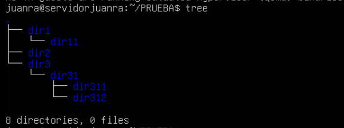
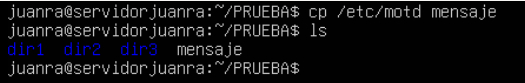
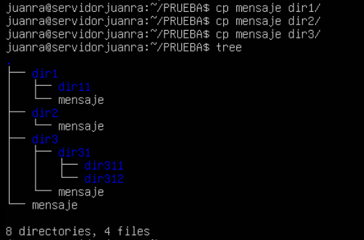
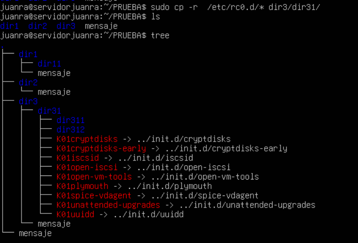

# Practica 1 - COMANDOS LINUX REPASO GENERAL

1. Crear los directorios dir1, dir2 y dir3 en un directorio PRUEBA. Dentro de dir1 crear el
directorio dir11. Dentro del directorio dir3 crear el directorio dir31. Dentro del directorio
dir31, crear los directorios dir311 y dir312.

2. Copiar el archivo /etc/motd a un archivo llamado mensaje en el directorio prueba

3. Copiar mensaje en dir1, dir2 y dir3. 
4. Comprobar el ejercicio anterior mediante un solo comando.

5. Copiar los archivos del directorio rc.d que se encuentra en /etc al directorio dir31

6. Copiar en el directorio dir311 los archivos de /bin que tengan una a como segunda letra y su nombre tenga cuatro letras.