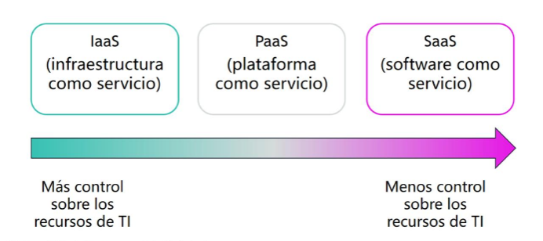
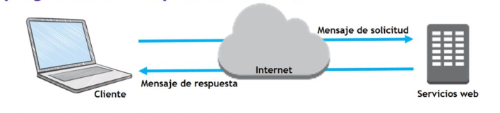

# Tema 1 Informacion general sobre los conceptos de la nube 

## 1. Introduccion a la informatica en la nube 
La informatica en la nube o cloud computing es la entrega de servicios de computacion, como servidores, almacenamiento, bases de datos, redes, software, etc, a traves de internet. En lugar de ser dueño de tu propia infraesctuctura, accedes a estos recursos de manera remota y pagas por su uso 

### 1.1. Modelo de informatica tradicional 
Infraestructura como hardware, es la solucion tradicional, pero requiere espacio, personal, seguridad fisica e inversion
Tiene un largo ciclo de adquisicion de hardware 

La informatica en la nube, permite ver la infrastructura como software en vez de como hardware 

### 1.2. Modelo de informatica en la nube
La infraestructura es como software, lo que permite flexibilidad, cambiar de forma facil rapida y sencilla de hardware 

## 2. Modelos de servicio en la nube

- **SaaS (Software como servicio):** El provedor en la nube gestiona y mantiene toda la infraestructura y el software. El usuario final solo accede a la aplicacion a travez de una app o navegador. Por ejemplo **Google Drive**

- **PaaS (Plataforma como servicio):** Proporciona un entorno de desarollo y despliegue de aplicaciones. El provedor se encarga de la infraestructura y el usuario gestiona las aplicaciones y crea los datos. Por ejemplo **Microsoft Azure o Red Hat OpenShift**

- **IaaS (Infraestructura como servicio):** Ofrece recursos de computación fundamentales, como servidores virtuales, almacenamiento y redes. El usuario tiene el máximo control y responsabilidad, instalando y gestionando su propio sistema operativo y aplicaciones. Por ejemplo **Google cloud compute engine o Amazon EC2**

## 3. Modelos de implememtacion de la informatica en la nube 

- **Modelo Nube (Publica):** En este modelo, todos los recursos de computación, como servidores, almacenamiento y bases de datos, son propiedad de un proveedor de servicios externo y se gestionan por este

- **Hibrido:** Este es un modelo que combina la nube pública con la infraestructura local (nube privada). Las aplicaciones y los datos pueden moverse entre ambas, lo que permite a las empresas usar la nube pública para cargas de trabajo menos críticas o picos de demanda, mientras mantienen los datos sensibles o aplicaciones críticas en su propia infraestructura.

- **Local (Nube Privada):** En este modelo, todos los recursos de computación se encuentran en el centro de datos de la propia organización. La empresa es la única responsable de comprar, gestionar y mantener todo el hardware y el software. Este enfoque ofrece el máximo control y seguridad. 

## 4. Ventajas de la informatica en la nube

- **Gastos variables:** Permite pagar solo por lo que se consume 
- **Elimina estimaciones sobre capacidad:** Se ajusta la capacidad de manera automatica segun la demanda
- **Velocidad y agilidad:** Los recursos estan disponibles en minutos 
- **Menos tareas administrativas:** Se reduce el gasto de gestion y mantenimiento 
- **Escala mundial:** Permite tener alcanze global

## 5. Introduccion a Amazon Web Services (AWS): 

**Servicio Web:** Es cualquier software que se pone a disposicion a travez de internet y utiliza un formato estandarizado para la solicitud y despuesta de una interaccion con la API

Es una plataforma segura en la nube con una amplia gama de productos globales que trabajan en conjunto. Ofrece acceso bajo demanda a recursos informáticos, de almacenamiento, de red y de base de datos

**Servicios:** AWS ofrece muchas categorías de servicios, como análisis, redes, bases de datos y seguridad. La elección de un servicio depende de los objetivos empresariales y los requisitos tecnológicos.

**Formas de interactuar con AWS:** Los usuarios pueden interactuar con AWS de tres maneras principales: a través de la Consola de administración de AWS (interfaz gráfica), la Interfaz de línea de comandos (AWS CLI) (comandos o scripts) o los Kits de desarrollo de software (SDK) para programar directamente desde el código

