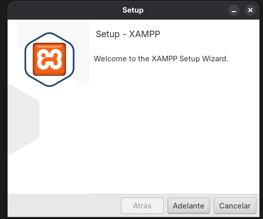
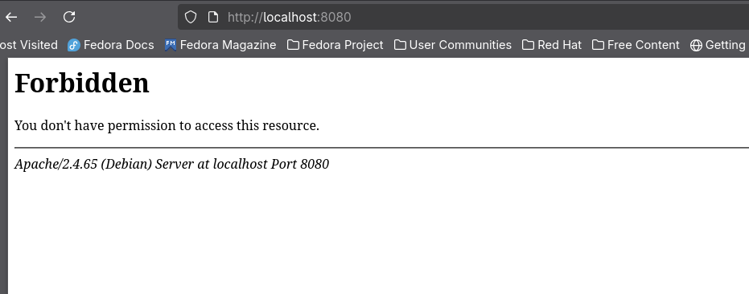

# Instalacion de Xampp en Fedora Silverblue 
## 1. Introduccion 
Este documento contiene los pasos para instalar el servidor web XAMPP en Linux (Fedora). XAMPP es un conjunto de herramientas que incluye Apache (servidor web), MariaDB (Base de datos), PHP y Perl, todo en un pack para facilitar su instalación. Normalmente, tal y como tengo mi sistema configurado, no debería dejarme instalar XAMPP de la forma tradicional por medio del instalador, pero hay soluciones para ello.

## 2. Requisitos Previos

Los requisitos mínimos de XAMPP son:

- Procesador Pentium o superior 
- 85 MB de espacio de disco 
- 128 MB de RAM 

En este caso, la instalación se realiza sobre 

- Fedora Linux Silverblue 

## 3. Instalacion 
### Paso 1:
Accedemos a la página de descarga de [XAMPP](https://www.apachefriends.org/es/download.html)

Nos desplazamos hasta la versión para nuestro sistema operativo:


Tomamos la última versión disponible.

### Paso 2: 
Localizamos el archivo de instalación en nuestro equipo y, al hacer clic derecho, seleccionamos "Ejecutar". Esto debería mostrar un error ya que no tiene permisos de administrador.


### Paso 3:

Desde una terminal, ejecutamos el instalador con 

``` sudo ./xampp-linux-x64-8.2.12-8-installer.run ``` 


### Paso 4: 

Pulsamos "Adelante" en todos los pasos siguientes para continuar con la instalación



Aquí se nos indica el directorio donde se instalará XAMPP: ``` /opt/lampp ``` 


La instalacion comenzara


### Paso 5:
Una vez finalizada la instalación, marcamos la casilla "Launch XAMPP" y hacemos clic en "Finish".


### Paso 6: 
Aquí vemos todos los servicios de XAMPP, aunque estén parados. Para iniciar alguno, hacemos clic sobre él y pulsamos en "Start", o iniciamos todos pulsando en "Start All"


Como se esperaba, XAMPP no funciona. Se intenta lanzar pero los servicios nunca se ejecutan. Esto se debe a que el sistema está configurado como inmutable, lo que solo permite la instalación de cierto software proveniente de los repositorios o, en su defecto, instalarlo en un contenedor


## Opcion 2 - Instalacion mediante podman compose 

XAMPP es un conjunto de programas en un solo paquete, por lo que se pueden instalar los componentes por separado usando contenedores y un fichero **podman-compose** para que trabajen juntos.

### Paso 1: 
Creamos el fichero podman-compose como el que se muestra a continuación. En este fichero se establecen los contenedores a usar, sus variables, la ubicación de los archivos, se mapean los puertos para conectar a los servicios, y se crea una red virtual para conectar todas las máquinas.

```yaml
version: '3'

services:
  mysql:
    image: mysql:8.0
    container_name: mysql_server
    command: --default-authentication-plugin=mysql_native_password
    restart: always
    environment:
      - MYSQL_ROOT_PASSWORD=12345
      - MYSQL_DATABASE=IAW
      - MYSQL_USER=user
      - MYSQL_PASSWORD=1234
    volumes:
      - /var/srv/mysql_data:/var/lib/mysql:Z
    ports:
      - "3306:3306"
    networks:
      - web_network

  apache_php_perl:
    image: mi-apache-php-perl:latest  
    build:
      context: .
      dockerfile: Dockerfile
    container_name: apache_server
    restart: always
    volumes:
      - ./www-data:/var/www:Z 
    ports:
      - "8080:80"
    networks:
      - web_network
    depends_on:
      - mysql

networks:
  web_network:
    driver: bridge
``` 

Este fichero funciona en conjunto con un Dockerfile , que define la instalación de programas y la configuración dentro de los contenedores

```yaml
# Usamos la imagen oficial de PHP con Apache como base
FROM php:8.2-apache

# Instalamos Perl y el módulo de Apache para Perl (libapache2-mod-perl2)
# apt-get es el gestor de paquetes de Debian, en el que se basa la imagen de PHP
RUN apt-get update && apt-get install -y \
    perl \
    libapache2-mod-perl2 \
    && rm -rf /var/lib/apt/lists/*

# Habilitamos el módulo de Perl en Apache.
# 'a2enmod' es una herramienta de Apache para habilitar módulos de forma segura.
RUN a2enmod perl

# Habilitamos la ejecución de scripts CGI/Perl, ya que es la forma más común de usar Perl con Apache.
RUN a2enmod cgi

# El puerto por defecto que usa la imagen base ya es el 80.
EXPOSE 80
```
### Paso 2: 

Para levantar todos estos servicios a la vez, se usa el comando ```podman-compose up -d```. Esto instalará automáticamente los servicios, los conectará, y realizará todo lo definido en el fichero.


### Paso 3: 
La base de datos se crea de manera automática, ya que lo hemos definido en el fichero, incluyendo sus credenciales.

```bash
environment:
MYSQL_ROOT_PASSWORD=contraseña_root
MYSQL_DATABASE=IAW
MYSQL_USER=user
MYSQL_PASSWORD=contraseña_usuario
volumes:
./db_data:/var/lib/mysql
```
El servidor Apache ya está levantado junto con PHP, y ahora está levantando MariaDB.


### Paso 4: 

Aquí se pueden ver los servicios levantados, las cadenas largas en hexadecimal indican el ID del contenedor 


### Paso 5: 
Al acceder a localhost y al puerto mapeado, vemos que hay un servidor web, aunque no muestra una página, pero sí funciona.



Desde el gestor gráfico de Podman, se puede ver el pod con los servicios creados.


### Paso 6: 

A diferencia de XAMPP, que incluye phpMyAdmin, en este caso se debe usar un gestor de bases de datos como Workbench. En la siguiente captura se puede ver la conexión con la base de datos y la creación de una tabla llamada "prueba" con dos columnas, "nombre" y "apellidos"


### Paso 7:
Para comprobar que Apache funciona, se copió un build de esta misma pagina web, y se puede ver en la URL que apunta a nustro localhost con el puerto mapeado.


Desde la terminal del contenedor de Apache, se pueden ejecutar comandos para, por ejemplo, ver que PHP está instalado.


## Bibliografia y herramientas usadas:

- [Podman](https://podman.io/docs)
- [Docker-Hub](https://hub.docker.com/_/httpd)
- [DBaver](https://dbeaver.io/)
- [Pods](https://flathub.org/en/apps/com.github.marhkb.Pods)
- [Fedora](https://silverblue.fedoraproject.org/)

- [RedHat](https://docs.redhat.com/es/documentation/red_hat_enterprise_linux/8/html/building_running_and_managing_containers/starting-containers-and-pods-with-podman_porting-containers-to-openshift-using-podman)
- [Podman-Docs](https://podman-desktop.io/docs/containers/creating-a-pod)


