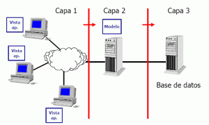

# Tema  1: INSTALACIÓN DE SERVIDORES DE APLICACIONES WEB

## 1. Introduccion

**Internet:** Red de redes que mediante un protocolo de comunicacion global comunica dispositivos identificados por direcciones IP 
**Direcciones IP:** IPv4 e IPv6 son protocolos que permiten referenciar servidores con una direecion numerica
**Web:** Sistema global de informacion basado en enlaces de hipertexto, permite a los usuarios acceder a una gran cantidad de recursos 
**W3C:** Comunidad que desarolla los estandares que controlan la Web 
**Navegador:** Software que permite el acceso a la web
**Surface Web:** Web convencional, visible para todos 
**Extensiones de navegador:** Son funcionalidades añadidas al navegador web 
**DeepWeb:** Contenidos de la web que no son indexados por los buscadores web
**DarkWeb:** Contenidos de la web que no son accesibles por los navegadores convencionales
**Web Scraping:** Tecnica que hace uso de diferentes software para extraer infromacion de los sitios web 

## 2. Evolucion de la Web 

- **WEB 1.0:** Paginas estaticas con contenido invariable, la interaccion de los usuarios con la web era limitada 
- **WEB 2.0:** Las paginas se volvieron mas dinaminas e interactivas, nace la web social 
- **WEB 3.0:** Se mejoraron las Webs, haciendolas mas amigables al usuario, con nuevas formas de busqueda y una mejora en la estructuracion de la web. Se introdujo la compatibilidad con dispositivos inteligentes 
- **WEB 4.0:** La exponencial evolución y la enorme cantidad de datos generados en Internet han dado lugar al Big Data procesamiento masivo de datos de distinta naturaleza que requieren una alta velocidad de proceso, conlleva lo que se conoce como 3V: **Volumen** , **Velocidad**, **Variedad**

## 3. Arquitectura Cliente - Servidor 
La arquitectura cliente-servidor es un modelo de aplicacion distribuida con dos elentos basicos: 

- Cliente: Inicia peticiones a los servidores 
- Servidor: Proporciona respuestas a los clientes 

| Ventajas | Inconvenientes|
|----------|----------|
| Escalabilidad | Congestion del trafico en la red |
| Disponibilidad | Necesidad de recursos |
|Control centralizado | Mantenimiento completo |

### 3.1 Tipos de arquitectura 

- **Arquitectura de dos niveles:**
El servidor espera una solictud del cliente -->  Busca en su sistema de archivos el archivo solicitado --> Si la peticion se puede atender devuelve el archivo, en caso contrario envia un mensaje de error 

- **Arquitectura de tres niveles:**
El cliente realiza una peticion al servidor --> El servidor hace uso de otro servidor para atender las peticiones (Servidor de aplicaciones) --> Otro servidor proporciona los datos al servidor de aplicaciones (servidor de datos)

- **Paradigma modelo-vista-controlador (MVC):** Separa en diferentes capas la arquitectura de una aplicacion software. Las aplicaciones web tienen las siguientes capas: 
    - **Vista**
    - **Controlador**
    - **Modelo**

## 4. Aplicaciones Web - Aplicaciones de escritorio

- **Aplicacion de escritorio:** Aplicaciones que se desarolla para un determinado sistema operativo
- **Aplicacion Web:** Aplicacion accesible a traves de un navegador.
- **Progresive web apps (WPA):** Son un hibrido entre aplicaciones web y aplicaciones de escritorio

## 5. Instalacion de servidores de aplicaciones Web
Un servidor web es un software y hardware encargado de atender las peticiones de los clientes de la web, un ejemplo de un servidor web puede ser: **Apache**

Otra solucion a la instalacion de servidores web, es el uso de contenedores como **docker**, que ofrecen todo el sistema de un servidor dentro de un paquete de servicios y que permiten el facil despliegue de replicas de manera inmensa haciendo uso de soluciones como **Kubernetes** o **docker swarm**.
