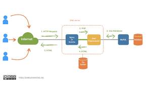

# Tema 2: PHP
PHP es el acronimo de **Hypertext Preprocesor**, ejecuta codigo en el servidor y devuelve un HTML al cliente, es compatible con bases de datos, el código PHP puede ser interpretado y ejecutado desde la interfaz de línea de comandos (CLI) o desde un servidor web que tenga implementado un intérprete PHP, php trabaja con **frameworks** que son una estructura predefinida de herramientas, librerías y convenciones que proporciona una base para desarrollar aplicaciones de software, sitios web o proyectos de marketing de forma más rápida y organizada, algunos frameworks para PHP son: Laravel, Slim. Aparte de PHO tenemos otros lenguajes como pueden ser **Python**, **Ruby** o **Node.js**




## Sintaxis basica de PHP 
La sintaxis de PHP es bastante simple y se parece a otros lenguajes como C o Perl.

- Bloques de código: El código PHP debe estar siempre dentro de las etiquetas <?php y ?>.
- Sentencias: Cada instrucción de código debe terminar con un punto y coma (;).
- Variables: Las variables se declaran usando el símbolo del dólar ($) seguido del nombre de la variable (ej. $mensaje).
- Comentarios: Puedes usar // o # para comentarios de una sola línea, y /* ... */ para comentarios multilínea.

El codigo PHP puede integrarse directamente en el HTML

## Variables 
Se representan con el simbolo **$** seguido por el nombre de la variable 
Por ejemplo: 

```php
<?php
$nombre=“Maria”;
?>
``` 
[Manual Variables](https://www.php.net/manual/es/language.variables.php)

## Tipos de datos 
- **Escalares:** int, float, string, bool
- **Compuestos:** array, object
- **ESpeciales:** null, resource 
Por ejemplo: 
```php
$edad = 25; // int
$precio = 19.99; // float
$activo = true; // bool
$nombre = "Ana"; // string
``` 

[Manual Tipos de Datos](https://www.php.net/manual/es/language.types.php)
## Funciones
### Constantes 
Es un identificador o nombre que no puede cambiar su valor durante la ejecucion del script. Son **Case sensitive**
Por ejemplo: 

```php 
<?php
define("CUOTA", 45.8);
?>
``` 
[Manual Constantes](https://www.php.net/manual/es/language.constants.php)

### Echo 
Se utiliza para mostrar el contenido de las variables y cadenas de texto
Por ejemplo: 
```php
<?php
echo “Hola amigo";
$n1 =250;
echo "El contenido de n1 es: $n1";
?>
``` 
[Manual Echo](https://www.php.net/manual/es/function.echo.php)

### Var_dump 
Es una funcion que muestra el contenido y tipo de una variable 
Por ejemplo: 
```php 
<?php
$ocupado = true;
var_dump($ocupado);
?>
``` 
[Manual Var_dump](https://www.php.net/manual/es/function.var-dump.php)

### Print_R 
Muestra informacion de una variable de forma legible 
Por ejemplo: 
```php
<?php

$colores = array("rojo", "verde", "azul", "amarillo");

echo "<pre>"; // La etiqueta <pre> en HTML formatea la salida para que sea más legible en un navegador web.
print_r($colores);
echo "</pre>";

?>
```
**Salida:** 

```bash 
Array
(
    [0] => rojo
    [1] => verde
    [2] => azul
    [3] => amarillo
)
``` 


[Manual print_r](https://www.php.net/manual/es/function.print-r)

## Operadores en PHP
- **Aritmeticos:** +, -, *, /, %.
- **Comparacion:** ==, ===, !=, <, >
- **Logicos:** &&, ||, !
Por ejemplo: 
```php 
if ($edad >= 18 && $activo) {
echo "Acceso permitido";
}
```
[Manual Operadores](https://www.php.net/manual/es/language.operators.php)


