# Practicas Tema 1
## Práctica 1.1 (confidencialidad): 
Encriptar un archivo usando el sistema EFS de windows, comprobar con otro usuario si se puede acceder al archivo.

Localizamos el archivo que queramos encriptar, hacemos clic derecho sobre el y despues pulsamos en **Propiedades**

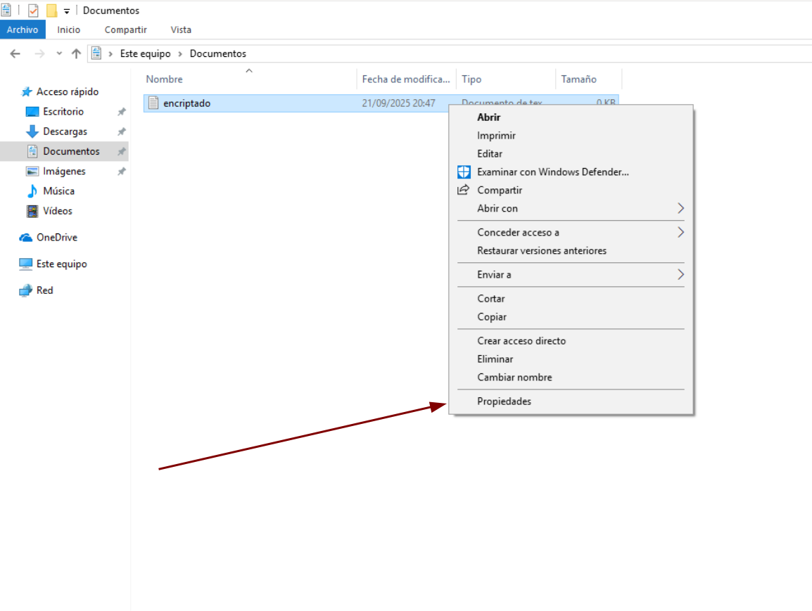

Despues pulsarememos en **Avanzados** en la seccion de atributos

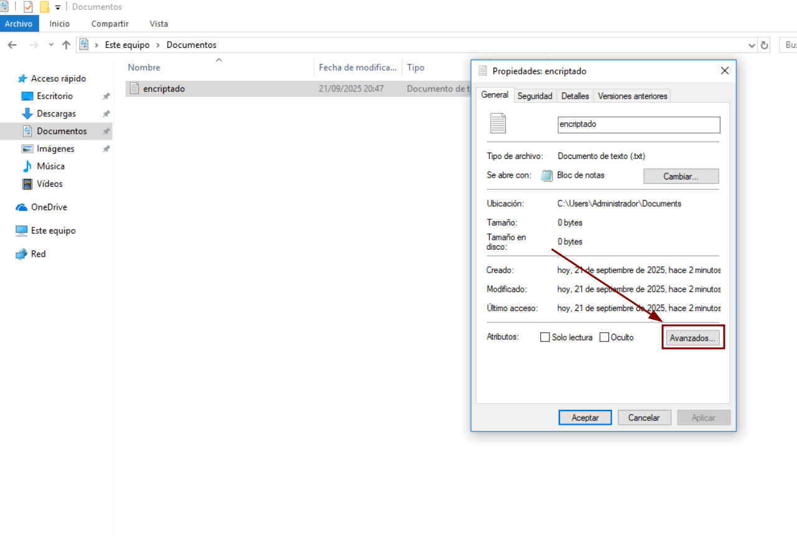

Despues marcaremos la casilla de **Cifrar contenido para proteger datos** y aceptar

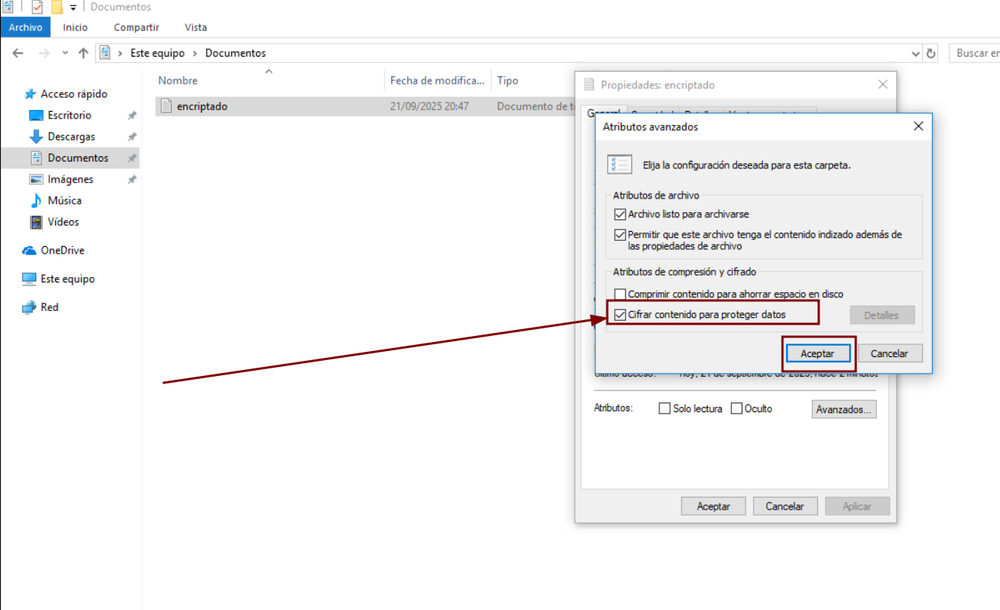

Pulsaremos en **Aplicar**

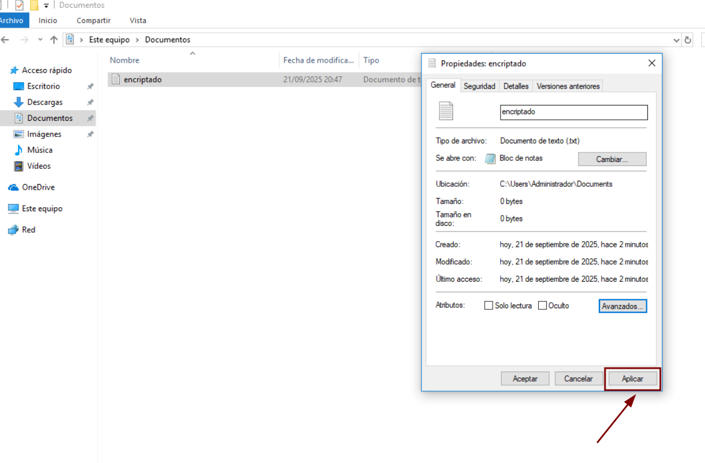

Nos saltara un aviso sobre lo que queremos cifrar, lo he dejado por defecto y pulsamos aceptar

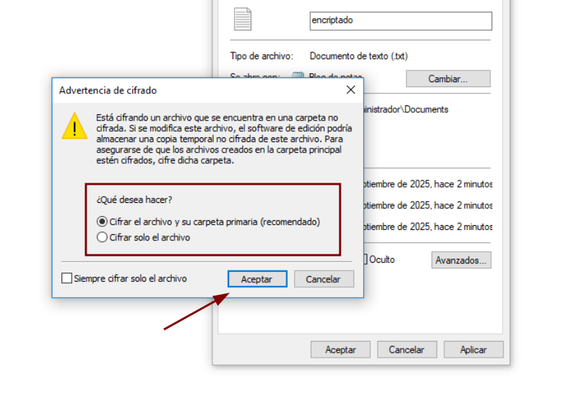

En la siguiente imagen vemos como ha cambiado el icono que ahora tiene un candado encima 

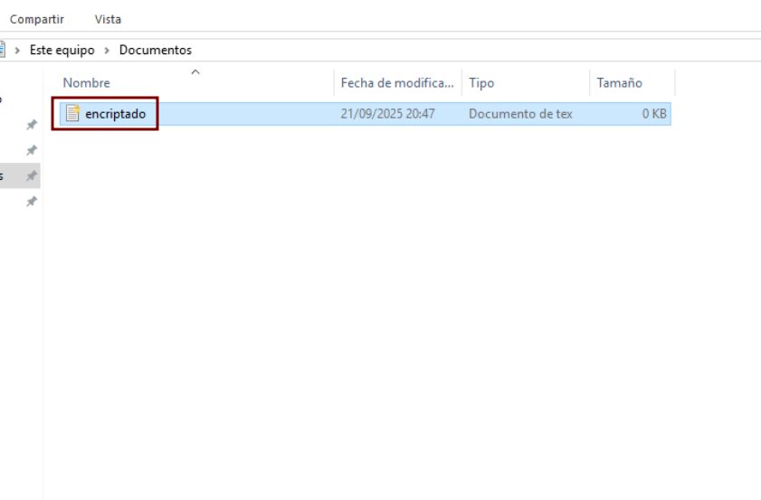

Ahora cambiaremos a otro usuario 

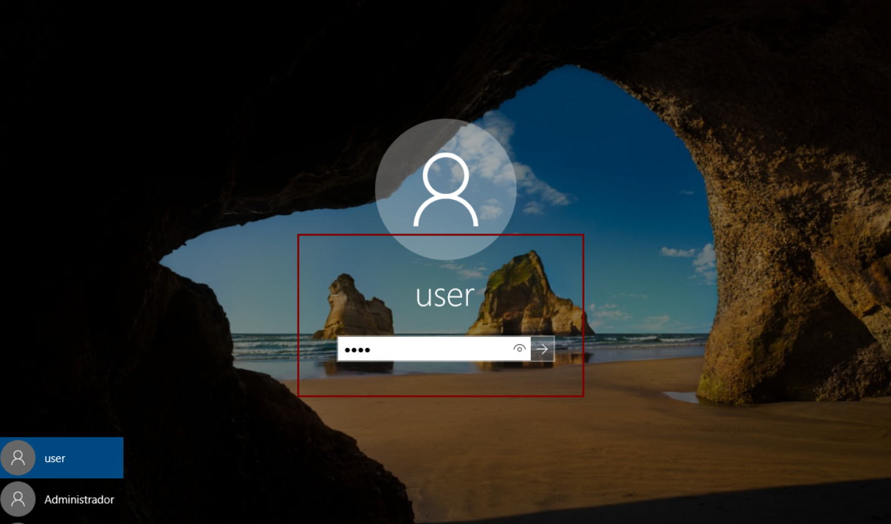

Localizamos el fichero que vemos que tiene un candado 

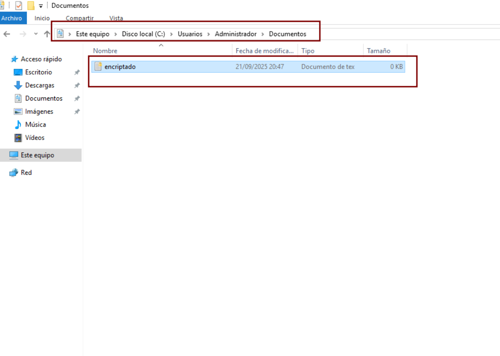

Al intentar acceder a el nos da el siguiente error 

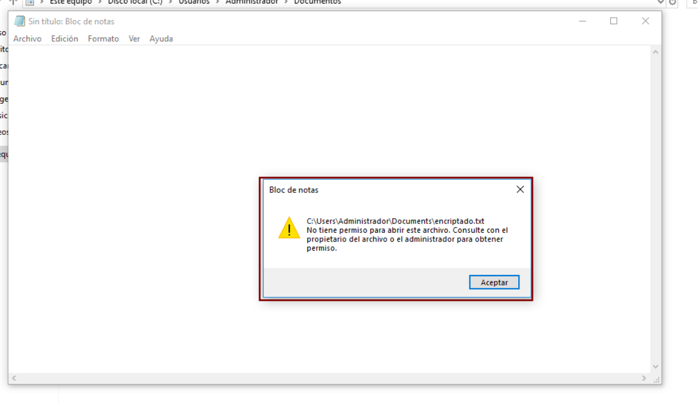

## Práctica 1.2 (integridad):
Comprobar si hay algun rootkit en el sistema usando una tulidad para nuestro sistema, yo en Linux usare Rootkit hunter

Primero lo instalamos en mi sistema se instala asi 

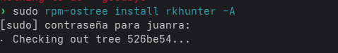

Y ahora ejeuctamos los siguientes comandos: 

- ```sudo rkhunter --update ``` Para actualizar la base de datos 
- ```sudo rkhunter --propupd ``` Para crrear la base de datos de propiedades de archivos
- ```sudo rkhunter --check ``` Para realizar el escaneo completo 

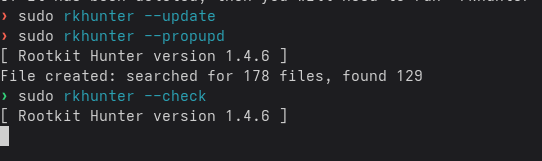

Como vemos salen muchos **Warning** pero si nos fijamos todos son archivos del sistema por lo que estos son falsos positivos (no creo que el comando chmod sea un rootkit)

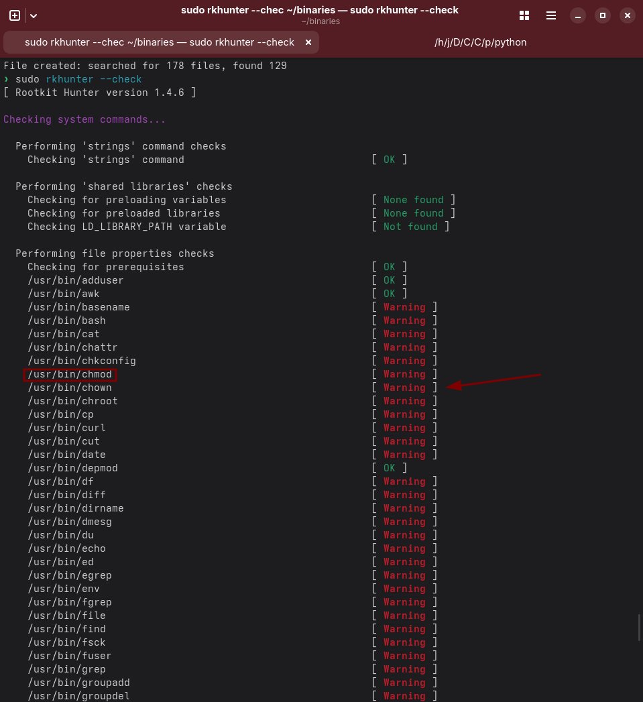 

Ahora buscara rootkits en archivos del sistema, como vemos todo esta correcto 

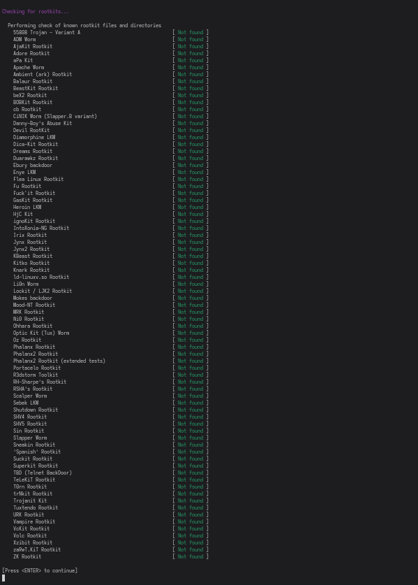


## Práctica 1.3 (disponibilidad): 
Indentificar servicios usando Nmap 

Yo ya lo tenia instalado por lo que no voy a enseñar como se instala 

Con el siguiente comando hacemos un ping scan que detecta si los hosts de mi red estan activos sin escanear puertos 

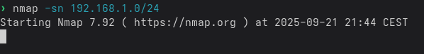


Vemos que ya ha finalizado y nos ha informado de los hosts que hay activos 

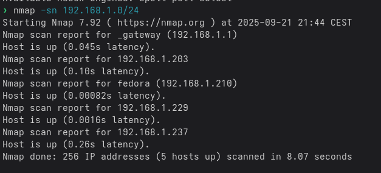

# Practica 2 - Analisis forense 

## 1. Analisis de cookies
Para localizar los ficheros de cookies en Linux usamos 
```bash 
find $HOME -type f -name '*cookies.sqlite*' -print 2>/dev/null
find $HOME -type f -name 'Cookies' -print 2>/dev/null
```
La base de datos esta cifrada como era de esperar
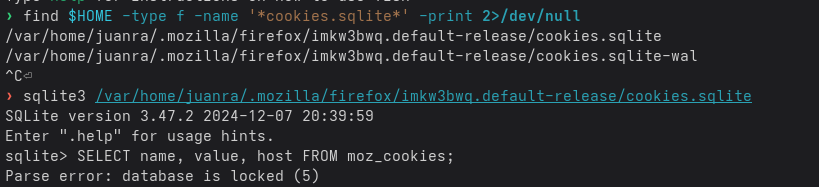

## 2. Ver los sitios donde se ha navegado 
Para localizar los ficheros de historial en Linux usamos
```bash 
find $HOME -type f -name '*history' -print 2>/dev/null
find $HOME -type f -name 'History' -print 2>/dev/null
``` 
En cambio la base de datos del historial si que es visible 

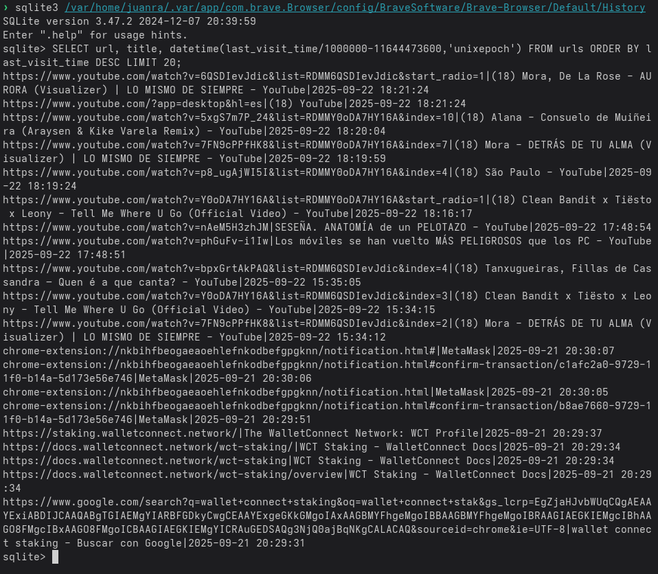

## 3. Ver historial de apps usadas
En linux no esta esta opcion, se puede ver el historial de comandos usados en la terminal 
```bash 
#Ver el historial de comandos del usuario 
cat $HOME/.bash_history

#Buscar otros archivos de historial 
find $HOME -type f -name '.*history' -print 2>/dev/null
```

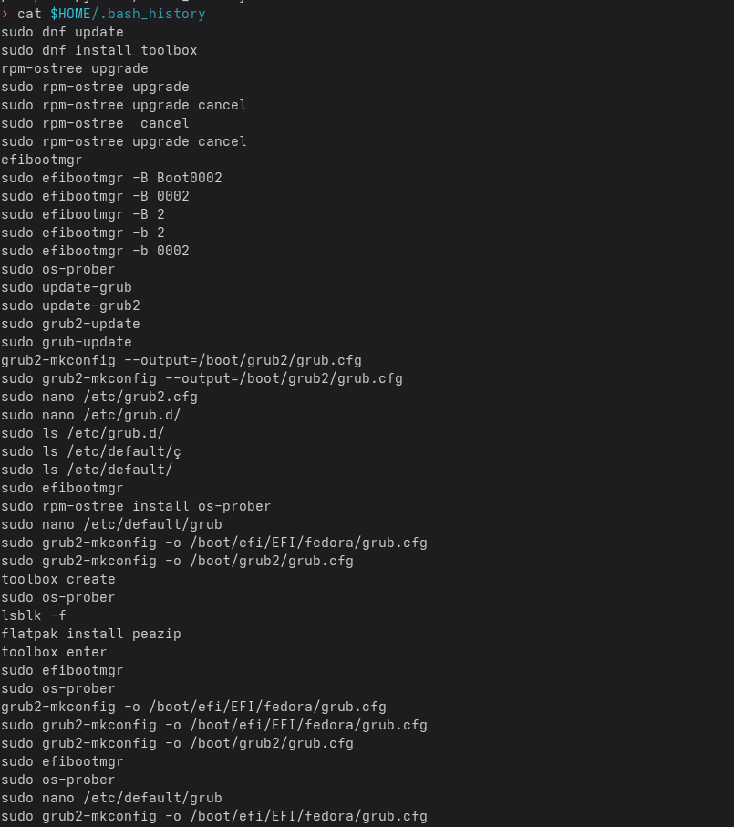
## 4. Herramienta MuiCacheView (Programas Lanzados)
El concepto de MuiCache es específico de Windows. En Linux, el lanzamiento de programas puede ser rastreado a través de logs del sistema 
```bash 
journalctl -n 50 -r -o short-monotonic
``` 
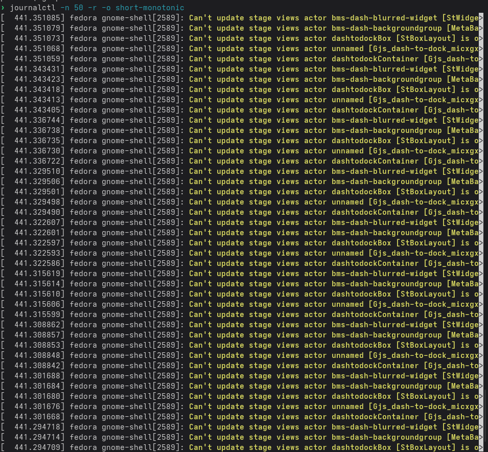

## 5. Búsqueda de miniaturas de fotos (borradas)
```bash 
find $HOME/.cache/thumbnails/ -type f -print 2>/dev/null | head -n 10
```
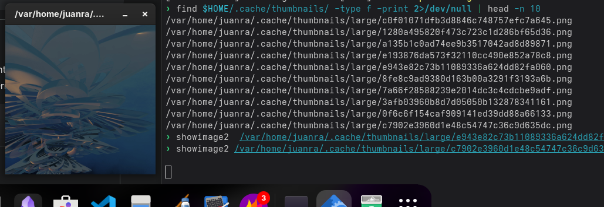

## 6. Captura del contenido de la memoria RAM (DUMPIT)
```bash 
sudo /sbin/insmod lime-$(uname -r).ko path=/ruta/a/Evidencias/ram_dump.lime format=lime
``` 
A mi no me funciona ya que me pide un modulo del kernel que ni tengo ni voy a compilar que pierdo las claves del secure boot 

## 7. Captura de la memoria de paginación (pagefile.sys)
``` bash
# Indentificamos la particion SWAP
swapon -s
```
