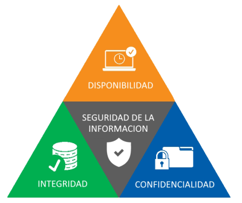

# Tema 1 Seguridad informatica 

## 1. Necesidad de la seguridad informatica
### 1.1 Seguridad de la informacion y seguridad informatica 
La informacion es el activo mas importante de cualquier empresa, por ello es importante protegerlo. 

**Seguridad de la informacion:** Conjunto de medidas preventivas y reactivas tanto humanas como tecnicas que afectan al almacenamiento y tratamiento de los datos, para reducir en gran medida las posibles amenazas a los mismos. Un aspecto importante a tener en cuanto es la seguridad legal, ya que todas las medidas todas las medidas y procedimientos que establezca la organización para preservar sus
datos deben estar reflejados en su política de seguridad y estar siempre dentro de la ley aplicable.

### 1.2 Sistemas de informacion 
Un sistema de informacion, es un conjunto de elementos organizados que trabajan juntos para administrar, recuperar y procesar datos de forma sencilla 
Algunos de estos elementos son: 
- **Recursos humanos**
- **Datos**
- **Actividades, procedimientos, pasos y tareas a seguir**
- **Recursos informaticos**

### 1.3 Sistema de gestion de la seguridad de la informacion (SGSI)

**SGSI:** Conjunto de politicas, procedimientos y recursos que una organizacion utiliza para proteger sus activos.
La base para desarollar un SGSI es identificar que activos se deben proteger y en que grado, para ello se utilizan las normas **ISO 27001** e **ISO 27002** asi como el **Ciclo de Deming** para asegurar la mejora continua 

**El ciclo de Deming se aplica en cuatro niveles:**
- **Planificar:** Se definen las politicas de seguridad, el alcance del SGSI y se realiza un analisis de riesgos 
- **Hacer:** Se implemente el SGSI, se ejecuta el plan de gestion de riesgos
- **Verificar:** Se monitorean las actividades y se realizan auditorias externas 
- **Actuar:** Se implementan mejoras, acciones preventivas y correctivas

Aspectos importantes para la implantacion del estandart **ISO 27001**: 
1. Compromiso y concienciacion 
2. Organizacion 
3. Analisis de procesos y servicios 
4. Gestion de riesgos 
5. Mejora continua 

## 2. Bases de la seguridad 
La seguridad informatica, un concepto que Spafford considera inalcanzable. Por eso se prefiere hablar de fiabilidad que es la probabilidad de que un sistema se conporte como se espera. 

### 2.1 Conceptos de seguridad informática: fiabilidad, confidencialidad, integridad y disponibilidad 
Un sistema informatico se considera fiable cuando cumple con tres propiedades, conocidas como la triada **CID**: 
- **Confidencialidad:** Asegura que solo los usuarios autorizados tengan acceso a la informacion y recursos del sistema 
- **Integridad:** Garantiza que solo los elementos autorizados puedan modificar, borrar o crear recursos del sistema 
- **Disponibilidad:** Mantiene los recursos accesibles para los usuarios autorizados en todo momento 

### 2.2 Alta disponibilidad
 Es la capacidad de un sistema para estar operativo sin interrupcion, 24 horas del dia, 7 dias de la semana 365 dias del años. Para medirla se usan dos metricas: 
 - **Tiempo medio entre fallos (MTTF)**
 - **Tiempo medio de recuperacion (MTTR)**

### 2.3 Medidas y mecanismos de seguridad
Para mantener la seguridad del sistema informatico se necesitan establecer unas medidas y mecanismos de seguridad, las medidas son genericas y se agrupan segun el objetivo: 
1. En base al elemento o activo que se protege 
    - **Seguridad fisica:** Trata de proteger el hardware, teniendo en cuenta la ubicacion y las amenazas de tipo fisico; robos, catastrofes naturales, etc. 
    - **Seguridad logica:** Protege el software tanto a nivel de sistema oerativo como de aplicaciones, sin perder nunca de vista el elemento fundamental a proteger la informacion o dato del usuarios 
2. En base al momento en el que se protege
    - **Seguridad activa:** Son preventivas y evitan grandes daños en los sistemas informaticos, por tanto se consideran acciones preventivas a un ataque 
    - **Seguridad pasiva:** Son correctivas, minimizan el impacto y efectos causados por accidentes es decir se consideran medidas o acciones posteriores a un ataque o incidente.

En cuanto a los mecanismos de seguridad, se dividen en tres grupos: 
1. **Prevencion:** 
    - Evitan desviaciones respecto a las politicas de seguridad, Ejemplo: Cortafuegos, IDS, IPS 
2. **Deteccion:**
    - Detectan las desviaciones, violaciones o intentos de violacion del sistema de seguridad, Ejemplo: Antivirus 
3. **Recuperacion:**
    - Se aplicacion cuando se ha detectado una violacion de la seguridad del sistema para recuperar su funcionamiento normal, Ejemplo: Copias de seguridad, puntos de restauracion 

### 2.3 Elementos vulnerables y vulnerabilidades 
Los elementos mas vulnerables de un sistema operativo, son: 
- **Hardware:** Son elementos tangibles o fisicos de nuestro sistema. 
- **Software:** Son los elementos logicos del sistema. 
- **Datos:** Estan constituidos por aquella informacion logca que procesan los programasas utilizando el hardware 
- **Otros:** Son elementos fingibles es decir los que se usan y gastan, como DVD, cintas de copias de seguridad. 

Las vulnerabilidades de los sistemas se pueden clasificar segun: 
- **Vulnerabilidades de origen fisico:** Se relacionan con el acceso fisico a las instalaciones. Si no se mantiene una buena politica de acceso al sistema 
- **Vulnerabilidades de origen natural:** Son imprevisibles e inevitables causadas por desastres naturales, aunque se pueden minimizar sus daños 
- **Vulnerabilidades de hardware:** Relacionadas con el mal funcionamiento de los dispositivos fisicos, por diversas causas: mal diseño de un componente, desgaste fisico, errores de fabricacion, etc. 
- **Vulnerabilidades de software:** Son las mas evidentes y conocidas, se basan en errores de programacion o diseño tanto de sistemas operativos o programas 
- **Vulnerabilidades de red:** Pueden conllevar la filtracion de informacion, o el acceso no autorizado a un sistema informatico, un elemento muy condicionante en la aparición de vulnerabilidades es la elección de la topología de la red (según cuál se elija seremos más sensibles a unas u otras amenazas).
- **Vulnerabilidades de factor humano:** Es el eslabon mas debil e incontrolable, ya que mediante ingenieria social se puede explotar y usar para acceder a los datos. 

### 2.4 Legislacion sobre seguridad
Algunas de las normas y estandares sobre la seguridad de la informacion, son: 
- **ISO 27000:**  Esta norma sirve como un glosario. Proporciona los términos y definiciones fundamentales que se utilizan en toda la serie 27000
- **ISO 27001:** Este es el estándar principal para certificar un Sistema de Gestión de Seguridad de la Información (SGSI). Contiene los requisitos que una organización debe cumplir para establecer, implementar, mantener y mejorar su seguridad de la información
- **ISO 27002:** A diferencia de la 27001, esta norma es una guía de buenas prácticas. Detalla un amplio catálogo de 133 controles de seguridad (organizados en 11 dominios) y 39 objetivos
- **ISO 27005:** Esta norma se centra específicamente en la gestión de riesgos. Proporciona directrices sobre cómo identificar, analizar, evaluar, tratar y monitorizar los riesgos relacionados con la seguridad de la información

## 3. Amenazas 
Una amenaza es un evento externo, intecionado o no que puede aprovechar una vulnerbilidad para causar un daño a un sistema. A diferencia de una vulnerabilidad, que es una debilidad interna del sistema, una amenaza es la acción que explota esa debilidad.
**Riesgo:** Surge cuando hay una vulnerabilidad y una amenaza que pueda explotarla 
**Impacto:** Es el daño que sufre un sistema cuando un riesgo se materializa en un evento real 

### 3.1 Tipos de amenzas segun el factor de seguridad 
- **Interceptacion:** Ocurre cuando un intruso no autorizado accede a la informacion, en este caso la **confidencialidad** se ve comprometida.
- **Modificacion:** Sucede cuando un intruso altera los datos o recursos del sistema, esto compromete la **integridad** y la **confidencialidad**.
- **Interrupcion:** Conlleva que un recurso del sistema se vuelva inutilizable o no este disponible, compromete la **disponibilidad**.
- **Fabricacion:** Un intruso inserta un objeto falsificado en un sistema, compromete la **autenticidad** y la **integridad**.

### 3.2 Clasificacion general de amenazas
- **Amenzas fisicas:** Afectan al hardware y las instalaciones, como robos, desastres naturales, cortes de energia, etc. 
- **Amenazas logicas:** Afectan al software y los datos, se manifiestan a traves de malware.

### 3.3 Ejemplos de malware 

- **Virus**: Código que se adjunta a un archivo ejecutable y se replica.
- **Gusano (Worm)**: Se auto-duplica y se propaga por la red, consumiendo recursos y, en ocasiones, causando daños.
- **Caballo de Troya (Trojan)**: Un software que parece útil pero que esconde funciones maliciosas, como dar acceso remoto al atacante.
- **Exploit**: Un programa diseñado para aprovechar una vulnerabilidad específica en otro software.
- **Bomba Lógica**: Código malicioso que se activa bajo ciertas condiciones, como una fecha u hora específicas.
- **Puerta Trasera (Backdoor)**: Un método oculto para saltarse la autenticación de un sistema.
- **Programa Espía (Spyware)**: Recopila información del usuario sin su consentimiento.
- **Grabador de teclado (Keylogger)**: Registra las pulsaciones de teclado para robar datos como contraseñas.
- **Rootkit**: Un conjunto de herramientas que permite a un atacante obtener control total sobre un sistema y ocultar su presencia.

## 4. Auditoria de seguridad de sistemas de informacion 
Una auditoria es un examen y analisis de un sistema informatico para identificar vulnerabilidades, el objetivo es encontrar y corregir debilidades antes de un ataque real. 

**Objetivos clase de una auditoria:**
- **Evaluar la seguridad:** Determinar el estado de la proteccion, los controles y medidas de seguridad de los activos 
- **Verificar el cumplimiento:** Asegurar que los sistemas cumplen las normativas
- **Generar un informe:** Proporcionar informes detallados con los hallazgos y recomendaciones 

### 4.1 Fases y tipos de auditoria 
Las auditorias siguen un proceso que incluye la enumeración de sistemas, la detección de vulnerabilidades, y la recomendación de medidas correctivas y preventivas. 
Existen diferentes tipos según el alcance:

- **Auditoria interna:** Revisa la seguridad dentro de la red local 
- **Auditoria perimetral:** Analiza la seguridad de la conexion local de la red interna en redes publicas 
- **Test de intrusion:** Simula un ataque para ver como resiste el sistema 
- **Auditoria de codigo de aplicaciones:** Analizael codigo fuente de una aplicacion para encontrar fallos de seguridad

## 5. Analisis forense 
A diferencia de la auditoria que se enfoca en la prevencion y mejora continua, el analisis forense se lleva acabo despues de un incidente de seguridad y busca evidencia digital de como ha sucedido el daño

### 5.1 Fases del analisis forense:

1. **Asegurameiento:** Proteger la "escena del crimen" para evitar alteraciones
2. **Identificacion:** Localizas todas las posibles fuentes de evidencia, disco duros, memorias usb, etc. 
3. **Recogida:** Se recopilan los dispositivos de manera segura documentando cada paso
4. **Obtencion y preservacion:** Se clona la evidencia digital para trabajar sobre ella, se usa **HASH** para verificar que el clon es identico al original
5. **Analisis:** Estudiar la evidencia, usando herramientas especializadas 
6. **Presentacion del informe:** Se crea un informe detallado de lo ocurrido, escrito de forma clara para personas sin conocimientos tecnicos 

