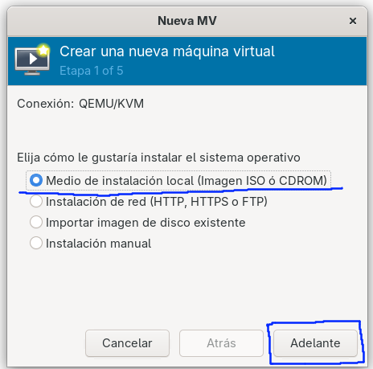

# Instalacion Windows Server 2022
Yo voy a usar LibVirt en vez de Vmware ya que en fedora silverblue que es lo que uso no se puede instalar otra cosa 

Esta primera captura muestra la pantalla inicial de Libvirt - que es una interfaz grafica para QEMU/KVM, en la esquina superior izquierda esta el boton para crear una maquina virtual

Ahora nos pregunta desde donde queremos instalar nuestra maquina virtual, seleccionamos medio local 

La siguiente imagen nos muestra el selector de medios de instalacion, aqui podemos elegir el sistema operativo a instalar y la ISO, para elejir la ISO, debemos pulsar en explorar y se abrira la ventana siguiente 

Se nos abre la siguiente ventana y tenemos que seleccionar **Explore localmente**, para buscar la ISO en nuestro sistema 

En el siguiente paso se configura la memoria RAM del sistema, en este caso vamos a definir 4GB (4096Mb)

Ahora creamos el disco duro, en este caso de 60Gb y pulsamos adelante 

Aqui finalmente vemos como quedaria nuestra instalacion, con un resumen de todo, pulsamos finalizar 

