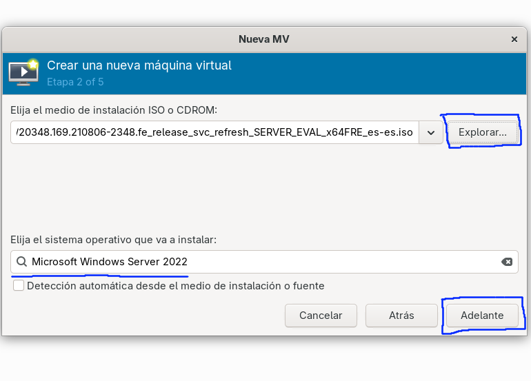
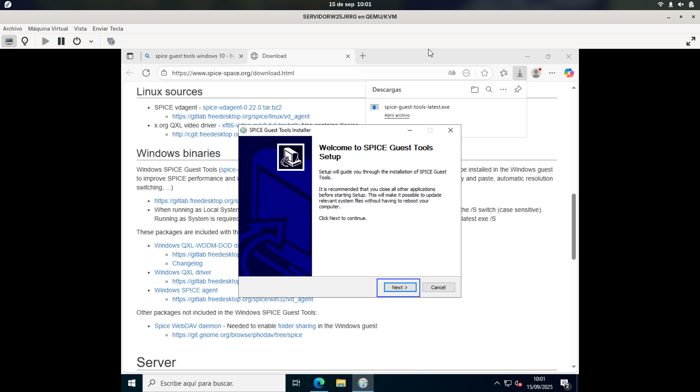
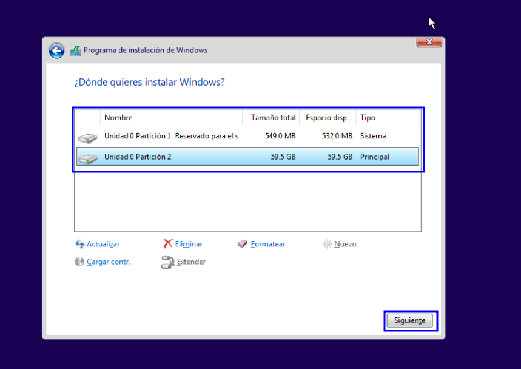

# Instalación Windows Server 2022 
Yo voy a usar Libvirt en vez de VMware, ya que en Fedora Silverblue, que es lo que uso, no se puede instalar otra cosa. Debido a que es un sistema inmutable y las opciones de virtualizacion solo son o QEMU/KVM o podman/docker 

Esta primera captura muestra la pantalla inicial de Libvirt (que es una interfaz gráfica para QEMU/KVM). En la esquina superior izquierda está el botón para crear una máquina virtual.


Ahora nos pregunta desde dónde queremos instalar nuestra máquina virtual. Seleccionamos medio local.


La siguiente imagen nos muestra el selector de medios de instalación. Aquí podemos elegir el sistema operativo a instalar y la ISO. Para elegir la ISO, debemos pulsar en explorar y se abrirá la ventana siguiente.



Se nos abre la siguiente ventana y tenemos que seleccionar **Explorar localmente** para buscar la ISO en nuestro sistema.


En el siguiente paso se configura la memoria RAM del sistema. En este caso, vamos a definir 4 GB (4096 MB).


Ahora creamos el disco duro, en este caso de 60 GB, y pulsamos adelante.


Aquí finalmente vemos cómo quedaría nuestra instalación, con un resumen de todo. Pulsamos finalizar.


Ahora iniciara el instalador de Windows Server


Esta primera pantalla nos pedirá que introduzcamos el idioma del sistema (aunque la ISO es la versión española y solo nos deja español).


En el siguiente paso solo debemos pulsar en **Instalar**


Y comenzará a cargar el instalador.


Esta primera pantalla nos pregunta qué tipo de versión de Windows Server vamos a usar. Tenemos 4 versiones diferentes: dos para servidor y dos para datacenter, y luego una versión en modo escritorio y otra en modo gráfico. Nosotros cogemos la segunda opción: modo servidor con interfaz gráfica.


En la siguiente ventana nos pregunta si queremos aceptar el EULA (es obligatorio).


Ahora nos preguntará el tipo de instalación que queremos: si actualizar una versión de Windows anterior o una instalación avanzada desde cero. Seleccionamos esta última opción.


El disco duro virtual es de 60 GB y queremos tener una partición de 50 GB y otra de 10 GB aproximadamente. Para ello, pulsamos en el disco a particionar y después en **Nuevo**.


Ahora definimos el tamaño del disco. Como queremos una partición de 50 GB y otra de 10 GB, en vez de 61000 MB, ponemos 51000 MB y así haría dos particiones diferentes. Pulsamos en **Aplicar**.


Ahora seleccionamos la partición de 50 GB para instalar el sistema y pulsamos en **Instalar**.


Nos saltará el siguiente aviso, informando de que faltan particiones del sistema. Al pulsar en **Aceptar**, las creará de manera automática.


Iniciará la instalación de Windows Server, se reiniciará automáticamente y nos saldrá esta pantalla, en la que introduciremos la contraseña. Después, pulsaremos **Finalizar**.


Al fin, Windows Server iniciará.


Nos saltará el aviso de la red local. Pulsamos en **Sí**.


## Activación de usuario administrador
Nos vamos al lanzador de programas de Windows y buscamos el simbolo del sistema (CMD), pulsamos click derecho y lo abrimos como administrador


Ahora escribimos el siguiente comando ```net user administrador /active:yes``` y pulsamos Intro.


Ahora vamos a comprobar que se ha habilitado el usuario administrador de manera correcta. Para ello, abrimos el cuadro de ejecutar, bien buscándolo en la barra de búsqueda o pulsando las teclas **Windows (Super) + R**.


En el cuadro de ejecutar escribimos ```secpol.msc``` y pulsamos Intro.


Se nos abrirá el panel de directivas de seguridad local. Aquí debemos buscar en Directivas locales > Opciones de seguridad > y dentro de opciones de seguridad buscamos **Cuentas: Estado de la cuenta de administrador**. Debe poner Habilitada.


## Instalacion de las Spice Tools (Guest Additinos de Libvirt)

Al igual que en virtualbox o vmware que se instalan los extras en la maquina virtualizada para agregar soporte de graficos, o arrastrar y soltar entre otros en libvirt tambien se instalan estas aunque no es tan simple como en las dos primeras opciones que es pulsar un boton 
En el caso de libvirt debemos irnos a la pagina de descarga de las [SpiceTools](https://www.spice-space.org/download.html)

En la página hay descargas para diferentes sistemas operativos. Para Windows hay que buscar la opción que diga **Windows Binaries** y pulsar el primer enlace.


Al ser software de código abierto no está firmado (ya que esto cuesta dinero), por lo que nos saltará el siguiente aviso de Smart Screen. Solo debemos pulsar en ejecutar.


La instalación comenzará.



Aceptamos el acuerdo de licencia.


Y después de un rato se finalizará la instalación.


## Configuración del navegador web
Como navegador, yo he elegido Firefox, ya que es el que uso a diario y el que menos recursos consume.


Para configurar la navegación privada de manera predeterminada en Firefox hay que hacer los siguientes pasos:
Abrimos el navegador y nos desplazamos al desplegable de la esquina superior derecha, como se ve en la imagen. Ahí pulsamos en Ajustes.


Una vez en Ajustes, en el buscador superior buscamos **Historial**. En la primera opción que señala **Firefox podrá:**, pulsamos y se abrirá un desplegable en el que seleccionaremos la última opción: **Usar una configuración personalizada para el historial**.


Después debemos marcar la casilla que dice **Usar siempre el modo de navegación privada**. Después de esto, todos los datos de la sesión de búsqueda se borrarán al salir.


## Configuracion contraseñas y nombre del equipo 

Ahora vamos a desabilitar las contraseñas seguras y el tiempo que tardan en expirar en el sistema 

Para cambiar estos ajustes nos vamos al Panel de administracion del servidor > Herramientas > Directivas de Seguridad Local


Una vez dentro de **Directivas de seguridad local**, nos desplazamos a Directiva de cuenta > Directiva de contraseña y pulsamos en **La contraseña debe cumplir los requisitos de complejidad**


Y ahora pulsamos en deshabilitado, despues en aplicar o aceptar. 


Ahora cambiaremos la vigencia maxima de la contraseña de 45 dias a 300 


Al final debe quedar asi


Ahora vamos a cambiar el periodo de actualizacion del servidor de 10 minutos a 1 minuto, para ello pulsamos en Administrar > Propiedades del administrador del servidor y en la primera opcion cambiamos el tiempo de 10 a 1  
Despues pulsamos **Agregar**


Ahora cambiaremos el nombre del equipo, para ello nos desplazamos a Administrador de archivos > Este equipo > Click derecho, propiedades > y bajamos hasta ver la opcion de **Cambiar nombre del equipo**


Al pulsar en **Cambiar nombre de equipo** se nos abre la siguiente ventana en la que introduciremos **SERVIDORW25XX**, despues pulsamos siguiente y **reiniciar mas tarde**


## Creacion de Redes Privadas (LAN) en Libvirt (QEMU)
Para crear una red privada en QEMU debemos primero crear la red mediante un fichero **.xml**, despues con ese fichero levantar la red y activarla, y una vez todo esto ya nos aparecera en LibVirt

Desde una terminal o con el editor de texto, creamos un archivo con el nombre que sea pero terminacion **.xml** y ponemos el siguiente contenido 

```
<network> 
    <name>nombre_de_la_red</name>
</network> 
```


Despues, ponemos los siguientes comandos para levantar la red privada 

- ```sudo virh net-define [fichero.xml]``` Este comando levanta la red
- ```sudo virsh net-start [nombre_red]``` Este comando inicia la red 
- ```sudo virsh net-autostart [nombre_red]``` Este comando inicia la red en el inicio del sistema 

Si qusieramos eliminar una red 

- ```sudo virsh net-undefine [nombre_red]``` Para desactivarla 
- ```sudo virsh net-destroy [nombre_red] ``` Para borrarla 


Para agregar hardware, pulsamos la bombilla al lado del icono del monitor, despues pulsamos en **Añadir hardware**


Despues seleccionamos el tipo de hardware, en este caso red, y vemos que nos sale **Red Virtual "red-windows"**, seleccionamos y pulsamos finalizar 


Ahora en la maquina windows server, con la LAN conectada, nos vamos al **Centro de redes y recursos compartidos** seleccionamos nuestro adaptador de red asignado a LAN, pulsamos en click derecho > Propiedades, despues **Pulsamos protocolo de internet version 4**.
Y establecemos la direccion IP de manera manual en este caso sera la **192.168.10.1**
Al acabar pulsamos Aceptar 


Les he cambiado el nombre, por que ahun que yo las indentifico asi se ve mas facil 


Desde una **CMD** podemos ver los ajustes de red y la configuracion haciendo ```ipconfig /all```


## Activacion
Desde un **CMD** y con la red NAT desactivada (sin acceso a internet), introducimos el siguiente comando para activar el windows Server y quitar la marca de agua de la esquina 
´´´ dism /online /set-edition:serverStandard /productkey:VDYBN-27WPP-V4HQT-9VMD4-VMK7H /accepteula ``` 


Al finalizar el proceso, nos preguntara si queremos reinciar, ponemos una **Y** para reiniciar 


## Configuracion de la contraseña en el usuario Administrador 

Para ello abrimos el Panel de control 


Nos desplazamos a cuentas de usuario 


Y ahi pulsamos en administrar otra cuenta


Una vez dentro hacemos doble clic en el usuario **Administrador**


Y pulsamos en cambiar la contraseña 


Y establecemos la contraseña 


Despues reiniciamos 

## Creacion de una snapshoot 

Ahora vamos a crear la snapshoot de la maquina cero, con lo basico ya creado, como forma de copia de seguridad por si algo sale mal, para ello en libvirt pulsamos vista > Instantaneas 


Abrimos el gestor de instantaneas y pulsamos en el **+** de la parte inferior 


Se nos abrira la siguiente ventana, establecemos el nombre el tipo de instantanea y la descripcion 


# Instalacion Windows 10
En clase se ha visto como hacer lo que se conoce como instalacion desatendida una opcion que esta en VirtualBox o Vmware pero en Libvirt no existe, por lo que yo he documentado una instalacion normal de Windows 10 

Seleccionamos medio de instalacion local y pulsamos adelante


Seleccionamos el archivo ISO, para ello pulsamos en Explorar 


Despues pulsamos en explorar localmente y buscamos nuestra imagen .iso 


Despues pulsamos siguiente 


Ahora establecemos la cantidad de RAM y el numero de CPUs a usar, lo he dejado por defecto y pulsamos adelante


Ahora definimos el tamaño del disco duro, por defecto lo da en 20Gb lo he subido a 60Gb 


En este ultimo paso definiremos el nombre de la maquina virtual , y podremos ver un resumen simplificado de nuestra maquina virtual, pulsamos en finalizar


Ahora comenzara la instalacion de Windows 10 (he saltado pasos por que es muy parecida a windows server, como las preguntas de recoleccion de datos, que he pulsado **No** en todo)


Pulsamos **Instalar ahora** para instalar Windows 10 


En el siguiente paso nos pedira clave del producto, no tengo clave entonces pulso en **No tengo clave de producto**


Ahora nos pedira la version de Windows, nos desplazamos en la lista y seleccionamos **Windows 10 Pro** y pulsamos siguiente


En el siguiente paso seleccionamos la segunda opcion **Instalar solo windows (avanzado)**


Ahora nos pasara al particionado del disco, donde seleccionaremos el disco que tenemos, y pulsaremos en **Nuevo**, nos pedira el espacio del disco, cogemos todos y pulsamos en **Aplicar**


El particionado se deberia ver algo asi 



Pulsamos siguiente y comenzara la instalacion 


 Al acabar Windows se reiniciara, y empezara la configuracion inicial del sistema, los primeros pasos son seleccion de idioma, distribucion de teclado... 

 

 Despues de un par de pasos molestos, nos perdira el nombre de la cuenta, le he puesto **Usuario**

 

 De contraseña no le he puesto ninguna 

 

Ahora nos empezaran a saltar las opciones de privacidad y cortana, pulsamos **NO** en todo


Despues de un rato se instalara 


## Activacion de Windows y cuenta de administrador 
Ahora vamos a activar windows mediante el CMD, para ello nos vamos al buscador de programas de windows, escribimos CMD y pulsamos clic derecho **Ejecutar como administrador**


Introducimos el siguiente comando ```SLMGR /IPK 6TP4R-GNPTD-KYYHQ-7B7DP-J447Y``` y pulsamos enter y luego **Aceptar**


Ahora ponemos el siguiente comando ```SLMGR /SKMS KMS.DIGIBOY.IR ``` pulsamos enter y aceptar 


Para finalizar ponemos el siguiente comando ```SLMGR /ATO ``` pulsamos enter y aceptar 


Ahora activaremos la cuenta de Administrador, para ello escribimos ```NET USER ADMINISTRADOR /ACTIVE:YES ``` 


Desde las directivas de seguridad local, podemos ver que la cuenta de administrador esta activada: 


